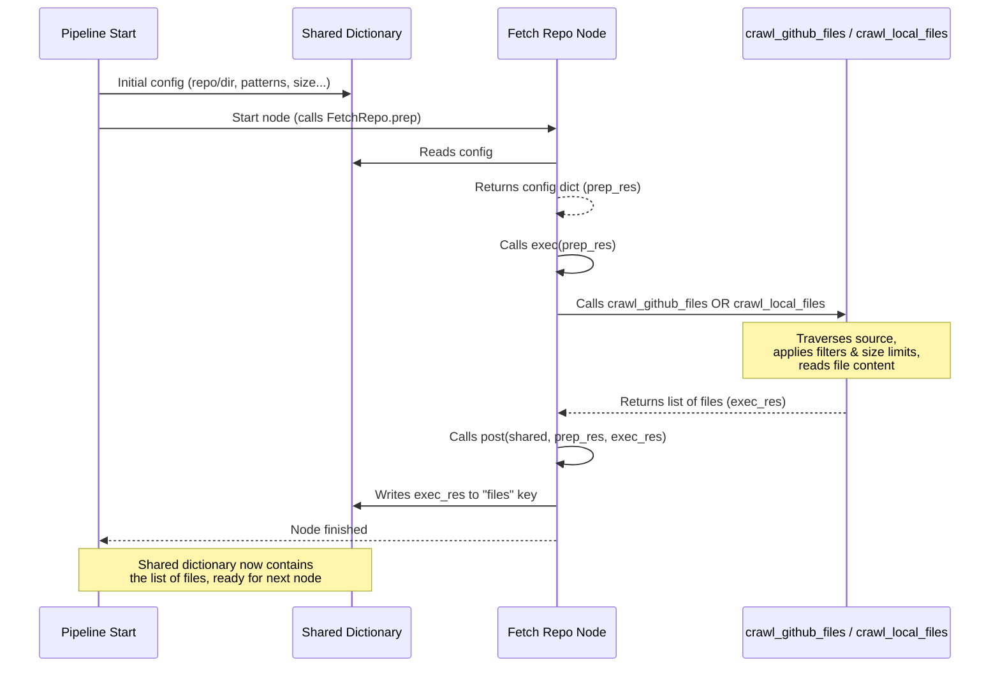

Welcome back to the tutorial for PocketFlow-Tutorial-Codebase-Knowledge!

In [Chapter 1: Command-Line Interface](01_command_line_interface_.md), we learned how to give the program instructions like where to find your code. [Chapter 2: Tutorial Generation Pipeline](02_tutorial_generation_pipeline_.md) showed us the overall assembly line of steps the program takes. And [Chapter 3: Shared Flow State](03_shared_flow_state_.md) explained the central `shared` dictionary that carries all the data throughout this pipeline.

Now, let's look at the *very first* worker on that assembly line – the **Codebase Crawler**.

## What Problem Does the Codebase Crawler Solve?

Before our tutorial generator can analyze your code, figure out its concepts, and write chapters, it needs one fundamental thing: **the code itself!**

Your project's source code isn't always neatly packaged in one place. It could be:
*   Hosted remotely on a platform like GitHub.
*   Sitting in a folder on your local computer.
*   Spread across many files and subdirectories.
*   Include various types of files (code, tests, documentation, build scripts, images).
*   Contain some files that are very large or perhaps contain sensitive data you don't want included.

The rest of the pipeline can't do its job until it has a list of relevant code files and their contents. The Codebase Crawler is the component responsible for solving this initial problem: **finding and collecting the raw source code files based on your instructions.**

Think of it like the diligent librarian we mentioned earlier. When you start a research project, you need to go to the library (or perhaps multiple libraries!) to gather all the books, articles, and documents you need. The librarian's job is to help you find them, check them out, and bring them back to your workspace. Our Codebase Crawler does this for source code.

## The Crawler's Role: The `FetchRepo` Node

In our pipeline ([Chapter 2](02_tutorial_generation_pipeline_.md)), the task of crawling the codebase is handled by a specific node called `FetchRepo`. It's the first node to run, because nothing else can happen until the code is available.

The `FetchRepo` node's main responsibilities are to:

1.  **Connect to the source:** Figure out if the code is on GitHub or local.
2.  **Traverse:** Go through the directories and subdirectories to find files.
3.  **Filter:** Apply the include/exclude patterns you provided via the CLI ([Chapter 1](01_command_line_interface_.md)) to decide which files are relevant code files and which should be ignored (like test files, build artifacts, etc.).
4.  **Limit Size:** Discard any files that are larger than the maximum size you specified. Large files can be difficult for subsequent analysis steps and for Large Language Models (LLMs).
5.  **Collect:** Gather the path and content of all the files that pass the filters and size check.

It's like the librarian checking the catalog, walking the aisles, ignoring the fiction section if you only asked for non-fiction (excluding), only picking up books on your reading list (including), making sure the books aren't too heavy or long for your bag (size limit), and finally bringing the stack of approved books back to your desk.

## How `FetchRepo` Works Under the Hood

Let's see how the `FetchRepo` node uses the `shared` dictionary ([Chapter 3](03_shared_flow_state_.md)) and helper functions to perform its job.

Like all nodes in PocketFlow, `FetchRepo` has `prep`, `exec`, and `post` methods:

1.  **`prep(self, shared)`:**
    *   **Reads Inputs:** This method reads the necessary configuration from the `shared` dictionary. This includes:
        *   `repo_url`: The GitHub URL (if provided).
        *   `local_dir`: The local directory path (if provided).
        *   `include_patterns`: The list of file patterns to include.
        *   `exclude_patterns`: The list of file patterns to exclude.
        *   `max_file_size`: The maximum size limit for files.
        *   `github_token`: Your GitHub token (if using a private repo or need higher rate limits).
    *   **Derives Project Name:** If you didn't provide a `--name` via the CLI, `prep` will try to figure out a sensible default name from the repo URL or directory path and store it in `shared["project_name"]`.
    *   **Prepares Data for `exec`:** It collects these inputs into a dictionary that it returns. This dictionary will be passed to the `exec` method.

    ```python
    # Simplified from nodes.py (FetchRepo)
    class FetchRepo(Node):
        def prep(self, shared):
            # Read configuration from shared
            repo_url = shared.get("repo_url")
            local_dir = shared.get("local_dir")
            # ... reads include/exclude patterns, max_file_size, token ...

            # Derive project name if not set
            project_name = shared.get("project_name")
            if not project_name:
               # Logic to derive name from repo_url or local_dir
               shared["project_name"] = derived_name

            return { # Return data needed by exec
                "repo_url": repo_url,
                "local_dir": local_dir,
                # ... other config ...
            }
        # ... exec and post methods ...
    ```
    *Explanation:* The `prep` method acts like setting up the librarian with your specific research request details: "Go to *this* library/folder, look for *these* types of documents, but *ignore* those, and only bring back things smaller than *this*."

2.  **`exec(self, prep_res)`:**
    *   **Performs Crawling:** This is where the main work happens. Based on whether `repo_url` or `local_dir` was provided, it calls the appropriate helper function:
        *   `crawl_github_files()` if given a `--repo` URL. This function uses the GitHub API or git clone to fetch file contents.
        *   `crawl_local_files()` if given a `--dir` path. This function walks the local file system.
    *   **Applies Filters/Limits:** These helper functions are responsible for implementing the include/exclude patterns and the `max_file_size` check during traversal. For local directories, `crawl_local_files` also respects `.gitignore` files by default, which is a standard way developers specify files/folders to ignore in a project.
    *   **Handles Errors:** If no files are found (e.g., wrong path, empty repo), it raises an error to stop the pipeline early.
    *   **Returns File List:** It returns a list of tuples, where each tuple is `(file_path, file_content)`.

    ```python
    # Simplified from nodes.py (FetchRepo)
    # ... prep method ...
    def exec(self, prep_res):
        # Get config from prep's result
        repo_url = prep_res["repo_url"]
        local_dir = prep_res["local_dir"]
        # ... get patterns, size, token ...

        if repo_url:
            print(f"Crawling repository: {repo_url}...")
            result = crawl_github_files(repo_url=repo_url, token=token, ...)
        else:
            print(f"Crawling directory: {local_dir}...")
            result = crawl_local_files(directory=local_dir, ...)

        files_list = list(result.get("files", {}).items())
        if len(files_list) == 0:
             raise ValueError("Failed to fetch files") # Stop if no files found

        print(f"Fetched {len(files_list)} files.")
        return files_list # Return the list of (path, content)

    # ... post method ...

    # Simplified example of a pattern check (inside crawl_local_files or crawl_github_files)
    def should_include_file(file_path, filename, include_patterns, exclude_patterns):
        # Check includes first
        included = False
        if include_patterns:
            for pattern in include_patterns:
                if fnmatch.fnmatch(relpath, pattern):
                    included = True
                    break
        else: # No include patterns means include everything by default
            included = True

        if not included:
            return False

        # Check excludes
        if exclude_patterns:
             for pattern in exclude_patterns:
                 if fnmatch.fnmatch(relpath, pattern):
                     return False # Excluded
        # Check gitignore (for local files)
        # if gitignore_spec and gitignore_spec.match_file(relpath): return False

        return True # Included and not excluded
    ```
    *Explanation:* The `exec` method is the librarian actually going and getting the books. It uses specialized tools (`crawl_github_files` or `crawl_local_files`) to handle the different sources, checks each potential document against your criteria (filters, size), and builds the final pile of acceptable documents. The simplified `should_include_file` shows how it uses the patterns read from `shared` to make decisions about individual files.

3.  **`post(self, shared, prep_res, exec_res)`:**
    *   **Writes Output to `shared`:** The list of files returned by the `exec` method (`exec_res`) is now ready. The `post` method takes this list and stores it in the `shared` dictionary under the key `"files"`. This makes the list of files available for all subsequent nodes in the pipeline.

    ```python
    # Simplified from nodes.py (FetchRepo)
    # ... prep and exec methods ...
    def post(self, shared, prep_res, exec_res):
        # exec_res is the list of (path, content) tuples from exec
        shared["files"] = exec_res # Store the list in shared

        # The shared dictionary now looks something like:
        # {
        #    "repo_url": "...",
        #    "local_dir": None,
        #    "project_name": "my-repo",
        #    "include_patterns": {".py", ".md"},
        #    "exclude_patterns": {"tests/*"},
        #    "max_file_size": 100000,
        #    "github_token": "...",
        #    "use_cache": True,
        #    "max_abstraction_num": 10,
        #    "files": [
        #        ("src/main.py", "print('hello')\n..."),
        #        ("docs/readme.md", "# My Project\n..."),
        #        # ... other files ...
        #    ],
        #    "abstractions": [], # Still empty
        #    "relationships": {}, # Still empty
        #    # ... etc.
        # }

    ```
    *Explanation:* The `post` method is the librarian placing the stack of gathered documents onto the central work table (the `shared` dictionary) labeled "Raw Files". Now, anyone else on the team can come to the table and pick up the "Raw Files" stack to start their work.

Here's a sequence diagram illustrating the `FetchRepo` process and its interaction with `shared`:



This diagram clearly shows `FetchRepo` getting initial instructions from `shared`, using a helper to get the actual data, and then putting that data back into `shared` for the rest of the pipeline.

## Input and Output of the Codebase Crawler

We can summarize the `FetchRepo` node's interaction with the `shared` dictionary like this:

| What `FetchRepo` Reads from `shared` (Inputs) | What `FetchRepo` Writes to `shared` (Output)               |
| :-------------------------------------------- | :--------------------------------------------------------- |
| `repo_url` (string, optional)                 | `project_name` (string, if not provided)                   |
| `local_dir` (string, optional)                | `files` (list of `(path: string, content: string)` tuples) |
| `github_token` (string, optional)             |                                                            |
| `include_patterns` (set of strings)           |                                                            |
| `exclude_patterns` (set of strings)           |                                                            |
| `max_file_size` (integer)                     |                                                            |
| `project_name` (string, optional)             |                                                            |
| `use_cache` (boolean)                         |                                                            |
| `max_abstraction_num` (integer)               |                                                            |
| `language` (string)                           |                                                            |

The list stored under the `"files"` key in `shared` is the primary output of this step. It's a list of tuples, where each tuple contains the relative path to the file and its entire content as a string. This list is exactly what the next nodes in the pipeline need to start analyzing the code.

## Conclusion

The Codebase Crawler, implemented as the `FetchRepo` node, is the essential first step in our tutorial generation pipeline. It acts as the diligent librarian, connecting to your specified code source (GitHub or local), traversing the files, applying filters based on patterns and size limits from your CLI inputs, and collecting the raw content of the relevant source code files.

This collected data, in the form of a list of file paths and contents, is then stored in the central `shared` dictionary under the `"files"` key. This ensures that the subsequent nodes in the pipeline, which need to read and analyze the code, have everything they need available in the shared state.

Now that we have the raw source code collected and stored in `shared["files"]`, the pipeline can move on to the next crucial step: reading through these files to identify the key concepts or "abstractions" that form the building blocks of the codebase.

[Next Chapter: Abstraction Identifier](05_abstraction_identifier_.md)

---

<sub><sup>Generated by [AI Codebase Knowledge Builder](https://github.com/The-Pocket/Tutorial-Codebase-Knowledge).</sup></sub> <sub><sup>**References**: [[1]](https://github.com/The-Pocket/PocketFlow-Tutorial-Codebase-Knowledge/blob/86b22475977019d4147523aa0a1c8049625db5e0/nodes.py), [[2]](https://github.com/The-Pocket/PocketFlow-Tutorial-Codebase-Knowledge/blob/86b22475977019d4147523aa0a1c8049625db5e0/utils/crawl_github_files.py), [[3]](https://github.com/The-Pocket/PocketFlow-Tutorial-Codebase-Knowledge/blob/86b22475977019d4147523aa0a1c8049625db5e0/utils/crawl_local_files.py)</sup></sub>

