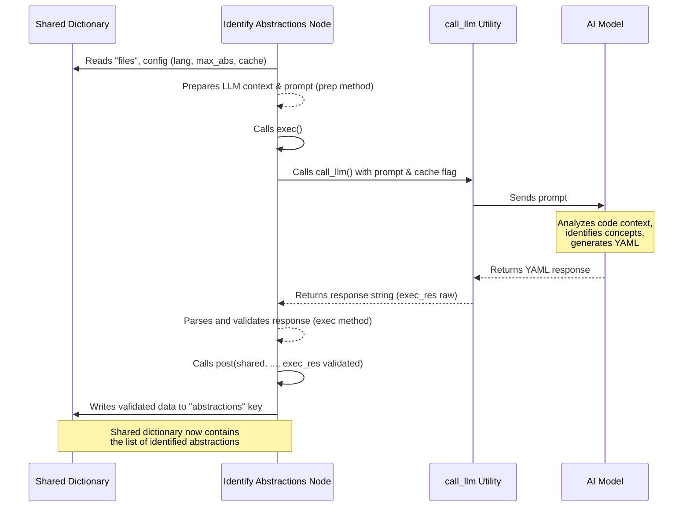

Welcome back to our journey through the PocketFlow-Tutorial-Codebase-Knowledge project!

In our previous chapters, we've set the stage:
*   [Chapter 1: Command-Line Interface](01_command_line_interface_.md) showed us how to tell the program which codebase to analyze.
*   [Chapter 2: Tutorial Generation Pipeline](02_tutorial_generation_pipeline_.md) introduced the overall sequence of steps the project takes.
*   [Chapter 3: Shared Flow State](03_shared_flow_state_.md) explained the central `shared` dictionary that carries data between steps.
*   [Chapter 4: Codebase Crawler](04_codebase_crawler_.md) detailed how the project gathers all the relevant code files from your specified source and puts them into that `shared` dictionary under the `"files"` key.

Now we have the raw material – the list of files and their content – sitting in our `shared` dictionary. But a pile of files isn't a tutorial! The next crucial step is to make sense of all that code and identify what the *main things* are that a beginner needs to understand.

This is the job of the **Abstraction Identifier**.

## What Problem Does the Abstraction Identifier Solve?

Imagine you've just been given a massive stack of building blueprints for a complex structure. It's thousands of pages, full of details about every pipe, wire, and nail. If someone asked you, "So, what is this building *about*?", you wouldn't start listing individual nails. You'd point out the foundation, the main support columns, the electrical system, the plumbing system, maybe the elevator shafts. These are the **core concepts** or **abstractions** of the building.

Similarly, a codebase, especially a large one, is full of countless lines of code spread across many files. It defines classes, functions, modules, configurations, and data structures. To understand the project, you don't need to know every single line of code immediately. You need to know the main components, the big ideas, the "building blocks" that make the project work.

The challenge is finding these main building blocks automatically from the raw text of the code files. This is what the Abstraction Identifier is designed to do.

**Our Use Case:** After the [Codebase Crawler](04_codebase_crawler_.md) collects all the code files, the Abstraction Identifier component analyzes their content to pinpoint the most important, core concepts or components within that codebase. These identified concepts will form the basis for the chapters in our tutorial.

Think of the Abstraction Identifier like that expert architect reviewing the building plans and quickly identifying the most crucial structural elements, like the foundation, main pillars, and key systems. It looks at the details but summarizes at a high level.

## The Identifier's Role: The `IdentifyAbstractions` Node

In our tutorial generation pipeline ([Chapter 2](02_tutorial_generation_pipeline_.md)), the task of finding these core concepts is handled by the `IdentifyAbstractions` node. This node runs immediately after `FetchRepo`.

The `IdentifyAbstractions` node's main responsibilities are to:

1.  **Read the Files:** Access the list of files and their content that was put into `shared` by the `FetchRepo` node.
2.  **Analyze High-Level:** Use an AI model (specifically, a Large Language Model, or LLM) to read and understand the purpose and structure of the code at a high level.
3.  **Identify Concepts:** Based on the analysis, determine what the 5-10 most important concepts, components, or abstractions are that represent the core functionality or structure of the codebase.
4.  **Describe Concepts:** For each identified concept, provide a concise name and a beginner-friendly description, often using an analogy.
5.  **Map to Files:** For each concept, identify which specific files are most relevant to understanding it.
6.  **Store Results:** Put the list of identified concepts (with their names, descriptions, and relevant file indices) back into the `shared` dictionary for later steps.

## How `IdentifyAbstractions` Works Under the Hood

Let's dive into the `IdentifyAbstractions` node and see how it accomplishes this using the `shared` dictionary ([Chapter 3](03_shared_flow_state_.md)) and the `call_llm` utility ([Chapter 10](10_llm_caller_utility_.md)).

Like other nodes, `IdentifyAbstractions` has `prep`, `exec`, and `post` methods:

1.  **`prep(self, shared)`:**
    *   **Reads Inputs:** This method reads the necessary data and configuration from the `shared` dictionary. The most important input here is the list of files collected by the previous node: `shared["files"]`. It also reads configuration like the `project_name`, desired `language` for the output, whether to `use_cache` for the LLM call, and the `max_abstraction_num` (the maximum number of concepts to identify, which defaults to 10 but can be set via the CLI).
    *   **Prepares LLM Context:** It takes the content of the files from `shared["files"]` and formats them into a single large text string that can be sent to the LLM. It adds clear markers like `--- File Index X: path/to/file ---` before the content of each file so the LLM knows which content comes from which file and can reference files by their index. It also creates a simple list of file indices and paths to give the LLM for easy reference.
    *   **Returns Data for `exec`:** It collects all the prepared context and configuration into a tuple that is returned and passed to the `exec` method.

    ```python
    # Simplified from nodes.py (IdentifyAbstractions)
    class IdentifyAbstractions(Node):
        def prep(self, shared):
            # Read inputs from shared
            files_data = shared["files"] # List of (path, content)
            project_name = shared["project_name"]
            language = shared.get("language", "english")
            use_cache = shared.get("use_cache", True)
            max_abstraction_num = shared.get("max_abstraction_num", 10)

            # Prepare context for LLM
            context = ""
            file_info = [] # To list files for the prompt
            for i, (path, content) in enumerate(files_data):
                # Format file content for context
                entry = f"--- File Index {i}: {path} ---\n{content}\n\n"
                context += entry
                file_info.append((i, path))

            # Format file info as a list for the prompt
            file_listing_for_prompt = "\n".join(
                [f"- {idx} # {path}" for idx, path in file_info]
            )

            # Return data needed by exec
            return (
                context,
                file_listing_for_prompt,
                len(files_data),
                project_name,
                language,
                use_cache,
                max_abstraction_num,
            )
        # ... exec and post methods ...
    ```
    *Explanation:* The `prep` method is like the architect gathering *all* the blueprints (from `shared["files"]`) and organizing them neatly with labels (like `--- File Index X: ... ---`) and an index ( `file_listing_for_prompt`) before starting the analysis. It also makes sure to note the project name and desired output language.

2.  **`exec(self, prep_res)`:**
    *   **Constructs the Prompt:** This is where the core instruction for the AI is built. It uses the context prepared in `prep` (the file contents and file list) and asks the LLM to identify the top 5 to `max_abstraction_num` concepts. It specifies the required output format: a YAML list of dictionaries, each containing a `name`, `description`, and a list of `file_indices` (referencing the file list provided). It also includes instructions for the language if it's not English.
    *   **Calls the LLM:** It uses the `call_llm` utility function ([Chapter 10](10_llm_caller_utility_.md)) to send the prompt to the AI model and get a response.
    *   **Parses and Validates Output:** The LLM's response is expected to be a YAML string. The `exec` method parses this string using a YAML library (`yaml.safe_load`). It then performs validation checks to ensure the output is in the correct format (a list of dictionaries with the required keys and correct data types). It specifically validates that the referenced `file_indices` are valid indices within the original list of files. If validation fails, it raises an error, which `pocketflow` can use to retry the node.
    *   **Returns Validated Data:** If validation passes, the method returns the structured list of identified abstractions.

    ```python
    # Simplified from nodes.py (IdentifyAbstractions)
    # ... prep method ...
    def exec(self, prep_res):
        # Unpack data from prep's result
        (
            context,
            file_listing_for_prompt,
            file_count,
            project_name,
            language,
            use_cache,
            max_abstraction_num,
        ) = prep_res

        print(f"Identifying abstractions using LLM...")

        # Construct the prompt for the LLM
        # This includes instructions on what to find, how to describe it,
        # how to link it to files, and the desired output format (YAML).
        # It also includes the actual file context and list.
        # (See the full prompt in the actual nodes.py file - it's quite long!)
        prompt = f"""... Prompt text here ...""" # Includes {context}, {file_listing_for_prompt}, {project_name}, {language}, {max_abstraction_num}

        # Call the LLM utility
        response = call_llm(prompt, use_cache=(use_cache and self.cur_retry == 0))

        # Parse the YAML response
        yaml_str = response.strip().split("```yaml")[1].split("```")[0].strip()
        abstractions = yaml.safe_load(yaml_str)

        # Perform validation checks (simplified)
        if not isinstance(abstractions, list):
             raise ValueError("LLM Output is not a list")
        validated_abstractions = []
        for item in abstractions:
            # Check structure, types, and validate file indices against file_count
            # ... validation logic ...
            # Ensure the output format is standardized (e.g., 'files' key instead of 'file_indices')
            validated_abstractions.append({"name": item["name"], "description": item["description"], "files": item["files"]})


        print(f"Identified {len(validated_abstractions)} abstractions.")
        return validated_abstractions # Return the structured list
    # ... post method ...
    ```
    *Explanation:* The `exec` method is the core AI analysis step. It gives the organized blueprints and index (`context`, `file_listing_for_prompt`) to the AI ("the expert architect"), asks specific questions about the core components, and expects the answers back in a structured format (YAML). It then meticulously checks the answers to make sure they make sense and follow the rules.

3.  **`post(self, shared, prep_res, exec_res)`:**
    *   **Writes Output to `shared`:** The validated list of abstractions returned by the `exec` method (`exec_res`) is now the output of this node. The `post` method takes this list and stores it in the `shared` dictionary under the key `"abstractions"`. This makes the list of identified concepts available for all subsequent nodes in the pipeline, like the one that will analyze relationships between them.

    ```python
    # Simplified from nodes.py (IdentifyAbstractions)
    # ... prep and exec methods ...
    def post(self, shared, prep_res, exec_res):
        # exec_res is the validated list of {"name": str, "description": str, "files": [int]}
        shared["abstractions"] = exec_res # Store the list in shared

        # The shared dictionary now looks something like:
        # {
        #    "repo_url": "...",
        #    # ... other initial config from main.py ...
        #    "files": [ # From FetchRepo
        #        ("src/main.py", "..."),
        #        ("docs/readme.md", "..."),
        #        # ... other files ...
        #    ],
        #    "abstractions": [ # <-- NEW! Added by IdentifyAbstractions
        #        {"name": "Command Line Interface", "description": "...", "files": [0]}, # Based on index 0 (src/main.py)
        #        {"name": "Tutorial Generation Pipeline", "description": "...", "files": [10, 11]}, # Based on indices 10 (flow.py), 11 (nodes.py)
        #        # ... up to max_abstraction_num concepts ...
        #    ],
        #    "relationships": {}, # Still empty
        #    "chapter_order": [], # Still empty
        #    # ... etc.
        # }
    ```
    *Explanation:* The `post` method is the architect writing down the list of identified core structural elements ("Foundation", "Main Support System", etc.) on the central project whiteboard (the `shared` dictionary) under the label "Key Concepts". Now everyone working on the project can see and use this list.

Here's a sequence diagram illustrating the `IdentifyAbstractions` process and its interaction with `shared` and the LLM:



This diagram shows `IdentifyAbstractions` taking the files from `shared`, processing them with the help of the LLM via `call_llm`, validating the results, and then storing the structured abstraction data back into `shared`.

## Input and Output of the Abstraction Identifier

We can summarize the `IdentifyAbstractions` node's interaction with the `shared` dictionary like this:

| What `IdentifyAbstractions` Reads from `shared` (Inputs) | What `IdentifyAbstractions` Writes to `shared` (Output) |
| :------------------------------------------------------- | :------------------------------------------------------ |
| `files` (list of `(path: string, content: string)` tuples) | `abstractions` (list of dictionaries)                   |
| `project_name` (string)                                  |                                                         |
| `language` (string)                                      |                                                         |
| `use_cache` (boolean)                                    |                                                         |
| `max_abstraction_num` (integer)                          |                                                         |

The primary output, stored under the `"abstractions"` key, is a list. Each item in the list is a dictionary representing a core concept, typically containing:
*   `name`: The name of the concept (e.g., "Query Processor").
*   `description`: A beginner-friendly explanation.
*   `files`: A list of integer indices corresponding to the relevant files in the original `shared["files"]` list.

This structured list of key concepts is the valuable information produced by this step, and it's now ready for the next node in the pipeline to use.

## Conclusion

The Abstraction Identifier, implemented as the `IdentifyAbstractions` node, is a critical step in turning raw code files into tutorial material. It leverages the power of an AI model to analyze the codebase content provided by the [Codebase Crawler](04_codebase_crawler_.md) and distill it into a list of core concepts or "abstractions." These abstractions are given beginner-friendly names and descriptions and linked back to the original files.

The result of this process is a structured list of concepts stored in the central `shared` dictionary under the `"abstractions"` key. This list is the project's understanding of "what the code is about" at a high level, forming the foundation for organizing and writing the tutorial.

Now that we have identified the main building blocks, the next step is to understand how these blocks fit together and interact. The next chapter will explore the Relationship Analyzer.

[Next Chapter: Relationship Analyzer](06_relationship_analyzer_.md)

---

<sub><sup>Generated by [AI Codebase Knowledge Builder](https://github.com/The-Pocket/Tutorial-Codebase-Knowledge).</sup></sub> <sub><sup>**References**: [[1]](https://github.com/The-Pocket/PocketFlow-Tutorial-Codebase-Knowledge/blob/86b22475977019d4147523aa0a1c8049625db5e0/nodes.py)</sup></sub>
