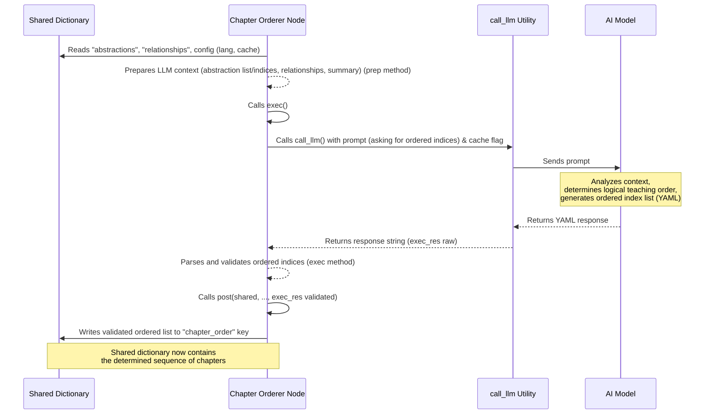

Welcome back to our exploration of the PocketFlow-Tutorial-Codebase-Knowledge project!

In the journey so far:
*   We learned how to start the process and provide instructions using the [Command-Line Interface](01_command_line_interface_.md).
*   We saw the overall steps the project takes, like an [assembly line or pipeline](02_tutorial_generation_pipeline_.md).
*   We understood the central role of the `shared` dictionary for managing and passing [data between steps](03_shared_flow_state_.md).
*   The [Codebase Crawler](04_codebase_crawler_.md) fetched all the relevant code files and put them into `shared["files"]`.
*   The [Abstraction Identifier](05_abstraction_identifier_.md) analyzed those files and identified the key concepts (abstractions), storing them in `shared["abstractions"]`.
*   The [Relationship Analyzer](06_relationship_analyzer_.md) figured out how these concepts interact and summarized the project, storing this info in `shared["relationships"]`.

Now we have the building blocks (`abstractions`) and a map showing how they connect (`relationships`). But for a tutorial, we can't just dump this information randomly! We need to present it in a logical sequence that helps a beginner learn step-by-step.

This is the crucial task of the **Chapter Orderer**.

## What Problem Does the Chapter Orderer Solve?

Imagine you're writing a textbook for beginners. You have a list of all the important topics (like variables, loops, functions, classes in programming) and you know how they relate (loops use variables, functions use loops, classes use functions).

You wouldn't start Chapter 1 with "Advanced Object-Oriented Design Patterns." You'd start with the basics: "What is a variable?" Then maybe "Basic Data Types," then "Control Flow (If statements, Loops)," and *then* perhaps "Functions" and later "Classes." You build understanding gradually, ensuring concepts are explained *before* they are used heavily in explaining other concepts.

The list of abstractions and their relationships generated by the previous steps gives us the topics and their connections, but not the best teaching sequence.

The challenge is to automatically determine this teaching sequence from the relationship data. This is what the Chapter Orderer component does.

**Our Use Case:** Based on the list of identified abstractions and the map of their relationships, this component determines the most logical and beginner-friendly order in which to present these concepts as tutorial chapters. It decides which concepts are foundational or good starting points and which ones build upon others.

Think of the Chapter Orderer as the textbook author making the table of contents. They look at the subject matter and decide the flow of chapters to create a smooth learning path.

## The Orderer's Role: The `OrderChapters` Node

In our pipeline ([Chapter 2](02_tutorial_generation_pipeline_.md)), the task of deciding the chapter sequence is handled by the `OrderChapters` node. This node runs after `AnalyzeRelationships`.

The `OrderChapters` node's main responsibilities are to:

1.  **Read Abstractions and Relationships:** Access the list of identified abstractions (`shared["abstractions"]`) and their relationships (`shared["relationships"]`) from the `shared` dictionary.
2.  **Analyze Dependencies:** Look at the relationships to understand which abstractions depend on or use others. Concepts that many others depend *on* are often good candidates to explain earlier. Concepts that depend *on* many others might be explained later.
3.  **Determine Logical Flow:** Use an AI model (the LLM) to process this dependency information and the abstraction descriptions to decide a sensible order for explaining them to a beginner. The goal is usually to move from general or foundational concepts to more specific or advanced ones.
4.  **Output Ordered List of Indices:** The result is a list containing the *indices* of the abstractions from the original `shared["abstractions"]` list, but arranged in the determined chapter order.
5.  **Store Results:** Put this ordered list of indices into the `shared` dictionary under the key `"chapter_order"`.

## How `OrderChapters` Works Under the Hood

Let's look inside the `OrderChapters` node in `nodes.py` and see how it uses the `shared` dictionary ([Chapter 3](03_shared_flow_state_.md)) and the `call_llm` utility ([Chapter 10](10_llm_caller_utility_.md)).

It follows the standard `prep`, `exec`, and `post` method structure:

1.  **`prep(self, shared)`:**
    *   **Reads Inputs:** This method reads the essential data and configuration from the `shared` dictionary: the list of `abstractions` (names, descriptions, files), the `relationships` data (summary and details), the `project_name`, the target `language`, and the `use_cache` flag.
    *   **Prepares LLM Context:** It constructs a context string for the LLM that clearly presents the abstractions with their indices and the relationships between them. It also includes the project summary from the relationships data, as the summary gives a high-level view that might help the LLM understand the overall purpose and identify potential starting points.
        *   It lists the abstractions, using their original index from the `abstractions` list (e.g., `- 0 # AbstractionName`).
        *   It lists the relationships, again using the indices (e.g., `- From 0 (NameA) to 1 (NameB): Label`).
        *   It includes the project summary.
    *   **Returns Data for `exec`:** Collects the prepared context and configuration into a tuple to pass to the `exec` method.

    ```python
    # Simplified from nodes.py (OrderChapters.prep)
    class OrderChapters(Node):
        def prep(self, shared):
            # Read inputs from shared
            abstractions = shared["abstractions"]  # List of dicts (index corresponds to position)
            relationships = shared["relationships"]  # Dict {"summary": ..., "details": [...]}
            project_name = shared["project_name"]
            language = shared.get("language", "english")
            use_cache = shared.get("use_cache", True)

            num_abstractions = len(abstractions)

            # Prepare context string for LLM
            # List abstractions with their indices (index corresponds to their position in shared["abstractions"])
            abstraction_info_for_prompt = []
            for i, a in enumerate(abstractions):
                # Use the original list index 'i' as the abstraction index
                abstraction_info_for_prompt.append(
                    f"- {i} # {a['name']}"
                )
            abstraction_listing = "\n".join(abstraction_info_for_prompt)

            # Add relationships context (using indices and names for clarity)
            context = f"Project Summary:\n{relationships['summary']}\n\n"
            context += "Relationships (Indices refer to abstractions above):\n"
            for rel in relationships["details"]:
                 # rel['from'] and rel['to'] are already integer indices from AnalyzeRelationships
                 from_name = abstractions[rel["from"]]["name"]
                 to_name = abstractions[rel["to"]]["name"]
                 context += f"- From {rel['from']} ({from_name}) to {rel['to']} ({to_name}): {rel['label']}\n"

            # Return data needed by exec
            return (
                abstraction_listing, # Formatted list "index # name"
                context,           # Summary and relationship descriptions
                num_abstractions,  # Total count for validation
                project_name,      # Project name
                language,          # Language for potential prompt hints
                use_cache,         # Cache flag
            )
        # ... exec and post methods ...
    ```
    *Explanation:* `prep` acts like the textbook author gathering the list of topics (with index numbers) and the diagram showing topic dependencies. It organizes this information to help the AI ("the expert educator") decide the best teaching flow.

2.  **`exec(self, prep_res)`:**
    *   **Constructs the Prompt:** This method builds the core instruction for the AI. It uses the context prepared in `prep` (list of abstractions with indices, relationships, summary) and asks the LLM for the "best order to explain these abstractions, from first to last" for a beginner. It instructs the LLM to output a YAML list of the indices, with a comment including the name for readability. It also adds hints about starting with foundational concepts.
    *   **Calls the LLM:** It uses the `call_llm` utility to send the prompt to the AI model.
    *   **Parses and Validates Output:** The LLM's response is expected to be a YAML list of items like `index # AbstractionName`. The `exec` method parses this YAML. It then performs critical validation checks:
        *   Ensuring the output is a list.
        *   For each item in the list, it parses the integer index (ignoring the name comment).
        *   It validates that each parsed index is a valid index within the range of the original abstractions list (0 to `num_abstractions - 1`).
        *   It checks for duplicate indices in the ordered list.
        *   **Crucially**, it verifies that the final ordered list contains *exactly* all the original abstraction indices (from 0 to `num_abstractions - 1`) and that the list has the correct total number of items (`num_abstractions`). If any index is missing or extra, validation fails.
        If validation fails, it raises an error, potentially triggering a retry by PocketFlow.
    *   **Returns Validated Data:** If validation passes, the method returns the validated list of integer indices in the determined order.

    ```python
    # Simplified from nodes.py (OrderChapters.exec)
    # ... prep method ...
    def exec(self, prep_res):
        (
            abstraction_listing, # "index # name" list
            context,           # Summary and relationships
            num_abstractions,  # Total count
            project_name,
            list_lang_note,    # Note about language for abstraction listing
            use_cache,
        ) = prep_res # Unpack all parameters
        print("Determining chapter order using LLM...")

        # The prompt asks the LLM to order the indices based on the provided context
        prompt = f"""
Given the following project abstractions and their relationships for the project `{project_name}`:

Abstractions (Index # Name){list_lang_note}:
{abstraction_listing}

Context about relationships and project summary:
{context}

If you are going to make a tutorial for `{project_name}`, what is the best order to explain these abstractions, from first to last?
Ideally, first explain those that are the most important or foundational, perhaps user-facing concepts or entry points. Then move to more detailed, lower-level implementation details or supporting concepts.

Output the ordered list of abstraction indices, including the name in a comment for clarity. Use the format `idx # AbstractionName`.

```yaml
- 2 # FoundationalConcept
- 0 # CoreClassA
- 1 # CoreClassB (uses CoreClassA)
- ...
```

Now, provide the YAML output:
"""
        response = call_llm(prompt, use_cache=(use_cache and self.cur_retry == 0)) # Use cache only if enabled and not retrying

        # --- Validation ---
        yaml_str = response.strip().split("```yaml")[1].split("```")[0].strip()
        ordered_indices_raw = yaml.safe_load(yaml_str)

        if not isinstance(ordered_indices_raw, list):
            raise ValueError("LLM output is not a list")

        ordered_indices = []
        seen_indices = set()
        for entry in ordered_indices_raw:
            try:
                # Parse the integer index from format like "2 # FoundationalConcept" or just "2"
                if isinstance(entry, int):
                    idx = entry
                elif isinstance(entry, str) and "#" in entry:
                    idx = int(entry.split("#")[0].strip())
                else:
                    idx = int(str(entry).strip())

                if not (0 <= idx < num_abstractions):
                    raise ValueError(
                        f"Invalid index {idx} in ordered list. Max index is {num_abstractions-1}."
                    )
                if idx in seen_indices:
                    raise ValueError(f"Duplicate index {idx} found in ordered list.")
                ordered_indices.append(idx)
                seen_indices.add(idx)

            except (ValueError, TypeError):
                raise ValueError(
                    f"Could not parse index from ordered list entry: {entry}"
                )

        # Final check: ensure *all* original abstractions are included exactly once
        if len(ordered_indices) != num_abstractions:
            raise ValueError(
                f"Ordered list length ({len(ordered_indices)}) does not match number of abstractions ({num_abstractions}). Missing indices: {set(range(num_abstractions)) - seen_indices}"
            )
        if seen_indices != set(range(num_abstractions)):
             # This check is slightly redundant given the previous two, but good for clarity
             raise ValueError(f"Ordered list does not contain all expected indices (0 to {num_abstractions-1}). Found: {sorted(list(seen_indices))}")


        print(f"Determined chapter order (indices): {ordered_indices}")
        return ordered_indices  # Return the validated list of indices

    # ... post method ...
    ```
    *Explanation:* The `exec` method is the AI's analysis where it decides the flow, like the expert educator figuring out the best curriculum sequence. The validation step is critical here – it ensures the AI didn't hallucinate indices, forget any concepts, or include duplicates. The result is a simple list of numbers, but their *order* is the key output.

3.  **`post(self, shared, prep_res, exec_res)`:**
    *   **Writes Output to `shared`:** The validated list of ordered indices returned by the `exec` method (`exec_res`) is the output of this node. The `post` method takes this list and stores it in the `shared` dictionary under the key `"chapter_order"`. This list is now available for the next node, the [Chapter Writer](08_chapter_writer_.md), which will use it to know which concept to write about for each chapter number.

    ```python
    # Simplified from nodes.py (OrderChapters.post)
    # ... prep and exec methods ...
    def post(self, shared, prep_res, exec_res):
        # exec_res is the validated list of ordered indices
        shared["chapter_order"] = exec_res  # Store the list of indices

        # The shared dictionary now looks something like:
        # {
        #    # ... initial config from main.py ...
        #    "files": [ # From FetchRepo
        #        ...
        #    ],
        #    "abstractions": [ # From IdentifyAbstractions (list of dicts)
        #        {"name": "CLI", ...}, # Index 0
        #        {"name": "Pipeline", ...}, # Index 1
        #        {"name": "Shared State", ...}, # Index 2
        #        {"name": "Crawler", ...}, # Index 3
        #        {"name": "Identifier", ...}, # Index 4
        #        {"name": "Relationships", ...}, # Index 5
        #        # ... etc.
        #    ],
        #    "relationships": { # From AnalyzeRelationships (dict)
        #        "summary": "...",
        #        "details": [ ... ], # Relationships based on indices from abstractions list
        #    },
        #    "chapter_order": [ # <-- NEW! Added by OrderChapters
        #        2, # Shared State first (foundational)
        #        0, # CLI (entry point)
        #        1, # Pipeline (orchestrates)
        #        3, # Crawler (first step in pipeline)
        #        4, # Identifier (next step)
        #        5, # Relationships (next step)
        #        # ... remaining indices in logical order ...
        #    ],
        #    "chapters": [], # Still empty
        #    "final_output_dir": None # Still empty
        #    # ... etc.
        # }
    ```
    *Explanation:* The `post` method is the textbook author writing down the finalized table of contents (the ordered list of topic indices) on the central project whiteboard (the `shared` dictionary) under the label "Chapter Sequence". This list now dictates the flow for writing the actual chapter content.

Here's a sequence diagram illustrating the `OrderChapters` process and its interaction with `shared` and the LLM:



This diagram shows `OrderChapters` taking the list of abstractions and their relationship map from `shared`, processing them with the LLM, validating the output rigorously, and then storing the resulting ordered list of indices back into `shared`.

## Input and Output of the Chapter Orderer

We can summarize the `OrderChapters` node's interaction with the `shared` dictionary like this:

| What `OrderChapters` Reads from `shared` (Inputs)           | What `OrderChapters` Writes to `shared` (Output) |
| :---------------------------------------------------------- | :----------------------------------------------- |
| `abstractions` (list of dictionaries)                       | `chapter_order` (list of integers)               |
| `relationships` (dictionary: `summary`, `details`)          |                                                  |
| `project_name` (string)                                     |                                                  |
| `language` (string)                                         |                                                  |
| `use_cache` (boolean)                                       |                                                  |

The primary output, stored under the `"chapter_order"` key, is a simple list of integers. The order of these integers dictates the order of the tutorial chapters. Each integer is an index referring back to an abstraction in the original `shared["abstractions"]` list.

## Conclusion

The Chapter Orderer, implemented as the `OrderChapters` node, is a critical component that translates the structural understanding of the codebase (captured by the identified abstractions and their relationships) into a pedagogical plan. By leveraging an AI model, it determines a logical sequence for presenting the concepts, ensuring that foundational ideas come first and building up complexity gradually.

The result of this process is an ordered list of abstraction indices, stored in the central `shared` dictionary under the `"chapter_order"` key. This list is the finalized "table of contents" for the tutorial and serves as the direct instruction for the next step: writing the content for each chapter.

Now that we have the order decided, the pipeline is ready for the most creative part: generating the actual Markdown content for each chapter.

[Next Chapter: Chapter Writer](08_chapter_writer_.md)

---

<sub><sup>Generated by [AI Codebase Knowledge Builder](https://github.com/The-Pocket/Tutorial-Codebase-Knowledge).</sup></sub> <sub><sup>**References**: [[1]](https://github.com/The-Pocket/PocketFlow-Tutorial-Codebase-Knowledge/blob/86b22475977019d4147523aa0a1c8049625db5e0/nodes.py)</sup></sub>

