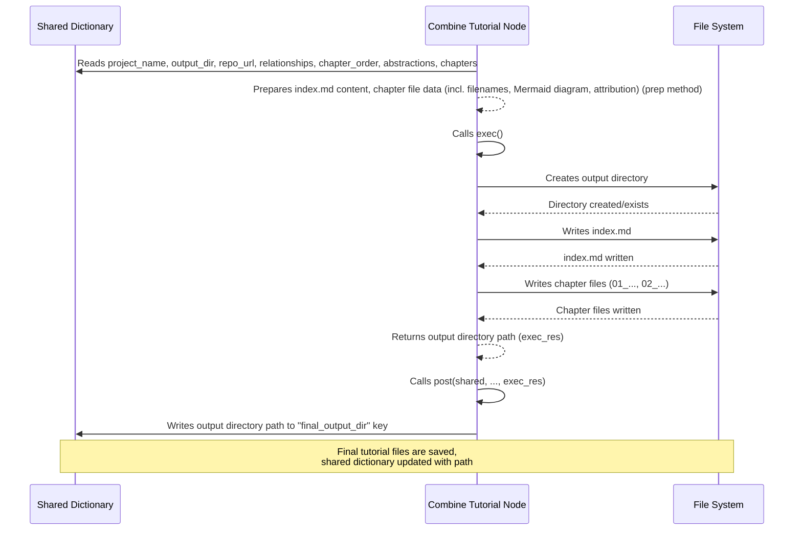

Welcome back to the final concept chapter of our PocketFlow-Tutorial-Codebase-Knowledge journey!

In the previous chapters, we've seen how the project:
*   Got instructions via the [Command-Line Interface](01_command_line_interface_.md).
*   Orchestrated its work through the [Tutorial Generation Pipeline](02_tutorial_generation_pipeline_.md), managing data in the [Shared Flow State](03_shared_flow_state_.md).
*   The [Codebase Crawler](04_codebase_crawler_.md) fetched the code.
*   The [Abstraction Identifier](05_abstraction_identifier_.md) found the key concepts.
*   The [Relationship Analyzer](06_relationship_analyzer_.md) mapped how concepts connect and summarized the project.
*   The [Chapter Orderer](07_chapter_orderer_.md) decided the learning sequence.
*   And most recently, the [Chapter Writer](08_chapter_writer_.md) generated the actual Markdown content for each individual chapter.

So, we now have all the pieces: a summary of the project, details on how the concepts relate, and the full text content for every chapter, all sitting in our `shared` dictionary under various keys like `"relationships"`, `"chapter_order"`, `"abstractions"`, and `"chapters"`.

But these are just data structures in memory. They aren't yet a set of files that you can open in a Markdown reader or publish online as a tutorial!

This is the essential job of the **Tutorial Combiner**.

## What Problem Does the Tutorial Combiner Solve?

Think about publishing a physical book. You have:
*   Finished chapter manuscripts from the author.
*   The cover art design.
*   Perhaps an introduction or preface.
*   A table of contents.
*   Information about the publisher and author.

You can't just hand someone this stack of materials. You need a bookbinder and publisher! Their job is to take all these components, print them (in our case, write to files), assemble them in the correct order (create the index linking to chapters), add the cover and introductory pages, and package the final product (save everything into a dedicated directory) so it's ready for readers.

In our project, the Tutorial Combiner does exactly this final assembly and publishing step. It takes all the finished pieces generated by the earlier nodes and bundles them into the final tutorial file structure.

**Our Use Case:** After all the creative and analytical work is done, the Tutorial Combiner takes the project summary, the relationship details, the ordered list of chapters, and the generated Markdown content for each chapter from the `shared` dictionary and combines them into the final set of Markdown files (`index.md` and the individual chapter files) within the specified output directory.

It's the final step on our assembly line, packaging the product before it's shipped out.

## The Combiner's Role: The `CombineTutorial` Node

In our pipeline ([Chapter 2](02_tutorial_generation_pipeline_.md)), this crucial final assembly task is handled by the `CombineTutorial` node. It's the very last node to run in the main sequence.

The `CombineTutorial` node's main responsibilities are to:

1.  **Gather All Final Data:** Read the project name, output directory path, source repository URL, the full relationships data (summary and details), the ordered list of chapters, the list of abstraction details (needed for names/filenames), and the actual list of generated chapter Markdown content strings from the `shared` dictionary.
2.  **Calculate Output Paths:** Determine the exact path where the tutorial directory and files should be created based on the specified output directory and the project name.
3.  **Generate `index.md` Content:** Create the content for the main index file (`index.md`). This file typically includes:
    *   The main tutorial title (using the project name).
    *   The project summary generated by the [Relationship Analyzer](06_relationship_analyzer_.md).
    *   A visual representation of the concept relationships, usually generated as a Mermaid diagram from the relationship details.
    *   A numbered list of chapters, with Markdown links to the individual chapter files, following the order determined by the [Chapter Orderer](07_chapter_orderer_.md) and using the names from the [Abstraction Identifier](05_abstraction_identifier_.md).
    *   Attribution for the generated tutorial.
4.  **Prepare Chapter File Data:** For each item in the ordered chapter list, determine the correct filename (e.g., `01_introduction.md`, `02_setup.md`) and pair it with the corresponding generated Markdown content. Add attribution to each chapter file content.
5.  **Create Output Directory:** Ensure the target directory for the tutorial files exists, creating it if necessary.
6.  **Write Files:** Write the generated `index.md` content to the `index.md` file in the output directory, and write the content of each individual chapter to its corresponding `.md` file.
7.  **Record Final Path:** Store the path of the created output directory back into the `shared` dictionary.

Unlike the `WriteChapters` node which was a `BatchNode` designed for iterative processing, `CombineTutorial` is a standard `Node`. It performs its setup in `prep`, its main work (file system operations) in `exec`, and its final state update in `post`.

## How `CombineTutorial` Works Under the Hood

Let's look inside the `CombineTutorial` node in `nodes.py` and see how it uses the `shared` dictionary ([Chapter 3](03_shared_flow_state_.md)) to assemble the final tutorial.

It follows the standard `prep`, `exec`, and `post` method structure:

1.  **`prep(self, shared)`:**
    *   **Reads Inputs:** Reads almost all the final output data from `shared`: `project_name`, `output_dir`, `repo_url`, `relationships`, `chapter_order`, `abstractions`, and `chapters`.
    *   **Calculates Paths:** Determines the full path for the output directory using `os.path.join(output_base_dir, project_name)`.
    *   **Generates Mermaid Diagram:** Iterates through the `abstractions` and `relationships["details"]` to construct the text for a Mermaid flowchart. It assigns node IDs (like `A0`, `A1`, etc.) based on the abstraction index, uses the abstraction names for node labels, and relationship labels for edge text. It includes basic sanitization to avoid common Mermaid syntax issues.
    *   **Generates `index.md` Content:** Assembles the Markdown string for `index.md` using the project name, summary from `relationships`, the generated Mermaid diagram, and a list of links to individual chapters. It loops through `chapter_order`, uses the `abstractions` list to get the name for the link text, calculates the filename (e.g., `01_concept_name.md`) based on the chapter number and abstraction name, and creates the `[Chapter Name](filename.md)` Markdown link. It adds the source repository link and final attribution.
    *   **Prepares Chapter Files Data:** Iterates through the `chapter_order` and the generated `chapters` content list. For each chapter, it calculates the correct filename (using the chapter number and the abstraction name from `abstractions`) and pairs it with the corresponding chapter content string from `shared["chapters"]`. It also adds the attribution to the end of *each* chapter's content string. This creates a list like `[{"filename": "...", "content": "..."}, ...]`.
    *   **Returns Data for `exec`:** Collects the calculated output path, the `index.md` content string, and the list of chapter file data (`[{"filename": str, "content": str}, ...]`) into a dictionary to pass to the `exec` method.

    ```python
    # Simplified from nodes.py (CombineTutorial.prep)
    class CombineTutorial(Node):
        def prep(self, shared):
            # Read inputs from shared - this node needs almost everything!
            project_name = shared["project_name"] # Potentially translated
            output_base_dir = shared.get("output_dir", "output")  # CLI default or user specified
            output_path = os.path.join(output_base_dir, project_name) # Final target directory

            repo_url = shared.get("repo_url")  # Source URL for link
            # Get data from previous nodes (potentially translated)
            relationships_data = shared["relationships"] # {"summary": str, "details": [...]}
            chapter_order = shared["chapter_order"]  # List of indices
            abstractions = shared["abstractions"] # List of {"name": str, ...}
            chapters_content = shared["chapters"] # List of strings (Markdown)

            # --- Generate Mermaid Diagram ---
            mermaid_lines = ["flowchart TD"]
            # Add nodes for each abstraction using potentially translated names
            for i, abstr in enumerate(abstractions):
                node_id = f"A{i}"
                # Use potentially translated name, sanitize for Mermaid ID and label
                # Basic sanitization: remove quotes, handle potential multi-line names (shouldn't happen with LLM output but defensive)
                sanitized_name = abstr["name"].replace('"', "").replace("\n", " ")
                node_label = sanitized_name # Using sanitized name for display
                mermaid_lines.append(f'    {node_id}["{node_label}"]') # Node label uses potentially translated name
            # Add edges for relationships using potentially translated labels
            for rel in relationships_data["details"]:
                from_node_id = f"A{rel['from']}"
                to_node_id = f"A{rel['to']}"
                # Use potentially translated label, sanitize
                edge_label = rel["label"].replace('"', "").replace("\n", " ") # Basic sanitization
                max_label_len = 30 # Keep labels short for diagram clarity
                if len(edge_label) > max_label_len:
                    edge_label = edge_label[:max_label_len-3] + "..." # Truncate if too long
                mermaid_lines.append(f'    {from_node_id} -- "{edge_label}" --> {to_node_id}') # Edge label uses potentially translated label

            mermaid_diagram = "\n".join(mermaid_lines)
            # --- End Mermaid ---

            # --- Prepare index.md content ---
            # Use potentially translated project name and summary from shared
            index_content = f"# Tutorial: {project_name}\n\n"
            index_content += f"{relationships_data['summary']}\n\n" # Use the potentially translated summary directly
            # Keep fixed strings like Source Repository link in English
            if repo_url: # Only add link if URL was provided
                index_content += f"**Source Repository:** [{repo_url}]({repo_url})\n\n"

            # Add Mermaid diagram (diagram content uses potentially translated names/labels)
            index_content += "```mermaid\n"
            index_content += mermaid_diagram + "\n"
            index_content += "```\n\n"

            # Keep fixed strings like "Chapters" heading in English
            index_content += f"## Chapters\n\n"

            chapter_files = [] # List to store {"filename": str, "content": str} for each chapter
            # Generate chapter links based on the determined order, using potentially translated names for link text and filenames
            for i, abstraction_index in enumerate(chapter_order):
                 # Ensure index is valid and we have content for it
                 if 0 <= abstraction_index < len(abstractions) and i < len(chapters_content):
                     abstraction_details = abstractions[abstraction_index]
                     abstraction_name = abstraction_details["name"] # Potentially translated name
                     # Sanitize potentially translated name for filename (basic)
                     safe_name = "".join(c if c.isalnum() else "_" for c in abstraction_name).lower()
                     filename = f"{i+1:02d}_{safe_name}.md" # e.g., 01_cli.md, 02_pipeline.md

                     index_content += f"{i+1}. [{abstraction_name}]({filename})\n" # Use potentially translated name in link text

                     # Add attribution to chapter content (using English fixed string)
                     chapter_content = chapters_content[i] # Get generated Markdown for this chapter (potentially translated)
                     if not chapter_content.strip().endswith("\n---"): # Avoid double attribution if LLM added one
                          if not chapter_content.endswith("\n\n"): chapter_content += "\n" # Ensure newline before separator
                          chapter_content += "\n---\n" # Add separator
                     # Keep attribution text in English
                     chapter_content += f"\n*Generated by [AI Codebase Knowledge Builder](https://github.com/The-Pocket/Tutorial-Codebase-Knowledge)*"


                     # Store filename and corresponding content for writing
                     chapter_files.append({"filename": filename, "content": chapter_content})
                 else:
                     print(f"Warning: Mismatch between chapter order, abstractions, or content at index {i} (abstraction index {abstraction_index}). Skipping file generation for this entry.")


            # Add attribution to index content (using English fixed string)
            if not index_content.strip().endswith("\n---"): # Avoid double attribution
                 if not index_content.endswith("\n\n"): index_content += "\n" # Ensure newline before separator
                 index_content += "\n---\n" # Add separator
            # Keep attribution text in English
            index_content += f"\n*Generated by [AI Codebase Knowledge Builder](https://github.com/The-Pocket/Tutorial-Codebase-Knowledge)*"


            # Return data needed by exec
            return {
                "output_path": output_path,
                "index_content": index_content,
                "chapter_files": chapter_files, # List of {"filename": str, "content": str}
            }

        # ... exec and post methods ...
    ```
    *Explanation:* `prep` acts like the book designer and typesetter. It takes all the final components from `shared` (the raw materials), calculates where the final "book" should go on the "shelf" (`output_path`), designs the "cover and contents page" (`index_content` including the diagram and chapter list), prepares each chapter for printing (adds attribution and calculates filenames), and organizes all of this data for the actual "printing" step (`exec`). Note that fixed strings like attribution and section headers are kept in English, while dynamic content from the LLM (project name, summary, abstraction names, relationship labels, chapter content) uses the potentially translated versions from `shared`.

2.  **`exec(self, prep_res)`:**
    *   **Gets Prepared Data:** Unpacks the `output_path`, `index_content`, and `chapter_files` list from `prep_res`.
    *   **Creates Directory:** Uses `os.makedirs` to create the final output directory. `exist_ok=True` means it won't raise an error if the directory already exists (useful for reruns).
    *   **Writes Files:** Opens and writes the `index_content` to `index.md`. Then, it loops through the `chapter_files` list and writes the content of each chapter to its corresponding filename within the output directory. It uses UTF-8 encoding for broad compatibility.
    *   **Returns Final Path:** Returns the absolute path of the created output directory.

    ```python
    # Simplified from nodes.py (CombineTutorial.exec)
    # ... prep method ...
    def exec(self, prep_res):
        # Unpack data from prep's result
        output_path = prep_res["output_path"]
        index_content = prep_res["index_content"]
        chapter_files = prep_res["chapter_files"]

        print(f"Combining tutorial into directory: {output_path}")

        # Create the output directory if it doesn't exist
        # Using os.makedirs to create parent directories too
        # exist_ok=True prevents an error if the directory is already there
        os.makedirs(output_path, exist_ok=True)
        print(f"  - Ensured directory exists: {output_path}")

        try:
            # Write index.md file
            index_filepath = os.path.join(output_path, "index.md")
            # Use utf-8 encoding for international characters
            with open(index_filepath, "w", encoding="utf-8") as f:
                f.write(index_content)
            print(f"  - Wrote {index_filepath}")

            # Write each chapter file
            for chapter_info in chapter_files:
                chapter_filepath = os.path.join(output_path, chapter_info["filename"])
                with open(chapter_filepath, "w", encoding="utf-8") as f:
                    f.write(chapter_info["content"])
                print(f"  - Wrote {chapter_filepath}")

        except IOError as e:
            # Catch file writing errors and raise them to signal node failure
            raise IOError(f"Error writing tutorial files to {output_path}: {e}")


        return output_path  # Return the path of the directory where files were saved

    # ... post method ...
    ```
    *Explanation:* The `exec` method is the actual "printing and assembly" step. It performs the file system operations – creating the folder and writing the content of the index and all chapter files to disk. Basic error handling for file operations is included.

3.  **`post(self, shared, prep_res, exec_res)`:**
    *   **Records Final Path:** Receives the path of the output directory (returned by `exec` in `exec_res`).
    *   **Writes to `shared`:** Stores this final output directory path in the `shared` dictionary under the key `"final_output_dir"`. This allows the `main.py` script (or any subsequent process if there were any) to know exactly where the tutorial was saved.
    *   **Prints Success Message:** Prints a user-friendly message indicating that the tutorial is complete and where to find it.

    ```python
    # Simplified from nodes.py (CombineTutorial.post)
    # ... prep and exec methods ...
    def post(self, shared, prep_res, exec_res):
        # exec_res is the path of the output directory returned by exec
        shared["final_output_dir"] = exec_res  # Store the final path in shared

        # Print a friendly success message using the recorded path
        print(f"\nTutorial generation complete! Files are in: {exec_res}")

    ```
    *Explanation:* The `post` method is the very last action of the pipeline's main sequence. It updates the `shared` state with the final result (the output directory path) and provides confirmation to the user.

Here's a sequence diagram illustrating the `CombineTutorial` process and its interaction with `shared` and the file system:



This diagram shows the `CombineTutorial` node pulling together all the final data from `shared`, performing the necessary formatting and file preparation in `prep`, writing the files to disk in `exec`, and finally recording the output location back in `shared` in `post`.

## Input and Output of the Tutorial Combiner

We can summarize the `CombineTutorial` node's interaction with the `shared` dictionary like this:

| What `CombineTutorial` Reads from `shared` (Inputs)                                       | What `CombineTutorial` Writes to `shared` (Output) |
| :---------------------------------------------------------------------------------------- | :----------------------------------------------- |
| `project_name` (string, potentially translated)                                           | `final_output_dir` (string)                      |
| `output_dir` (string)                                                                     |                                                  |
| `repo_url` (string, optional)                                                             |                                                  |
| `relationships` (dictionary: `summary`: string, `details`: list, potentially translated) |                                                  |
| `chapter_order` (list of integers)                                                        |                                                  |
| `abstractions` (list of dictionaries: `name`: string, `description`: string, potentially translated) |                                                  |
| `chapters` (list of strings, Markdown content, potentially translated)                    |                                                  |

The primary output, stored under the `"final_output_dir"` key, is a string containing the absolute path to the directory where the generated tutorial files were saved.

## Conclusion

The Tutorial Combiner, implemented as the `CombineTutorial` node, is the vital final step in the tutorial generation pipeline. It acts as the bookbinder and publisher, taking all the components generated by the preceding nodes – the project summary, relationship map, chapter order, and the written chapter content – and assembling them into a coherent, ready-to-use tutorial package.

It generates the main `index.md` file with the project overview, relationship diagram, and a list of chapters, calculates the correct filenames, adds attribution, and writes all the files into the specified output directory. Finally, it updates the central `shared` dictionary with the location of the finished tutorial, allowing the user interface (`main.py`) to inform you where to find your generated documentation.

With this step complete, the tutorial generation process is finished, and you have a structured Markdown tutorial of your codebase!

This concludes the core steps of the tutorial generation pipeline. The final chapter will look at a utility function that was used by several of these nodes: the LLM Caller.

[Next Chapter: LLM Caller Utility](10_llm_caller_utility_.md)

---

<sub><sup>Generated by [AI Codebase Knowledge Builder](https://github.com/The-Pocket/Tutorial-Codebase-Knowledge).</sup></sub> <sub><sup>**References**: [[1]](https://github.com/The-Pocket/PocketFlow-Tutorial-Codebase-Knowledge/blob/86b22475977019d4147523aa0a1c8049625db5e0/nodes.py)</sup></sub>

