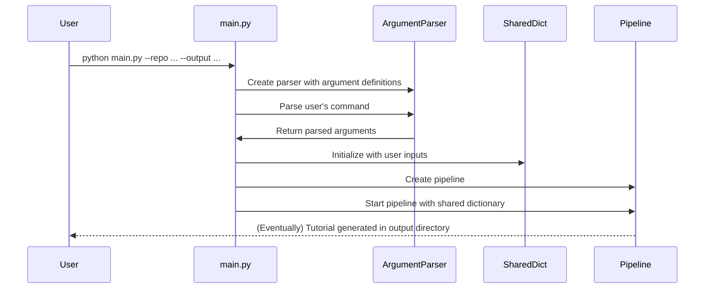

Welcome to the first component of the AI Codebase Knowledge Builder! In this chapter, we'll explore how the system interacts with you, the user, through its Command-Line Interface (CLI).

## What Problem Does the CLI Solve?

Before we dive into code, let's understand why the Command-Line Interface exists and what role it plays.

Imagine you want to generate a tutorial for a specific codebase. You need a way to tell the system:

1. **Where to find the code** - Is it on GitHub, or in a folder on your computer?
2. **What to name the tutorial project**
3. **Where to save the generated files**
4. **Which files to include or exclude**
5. **What language to use for the tutorial**

The Command-Line Interface solves this communication problem. It's like the front desk of a hotel - the place where you check in, provide your preferences, and set expectations for your stay. The CLI collects all your requirements through simple text commands and passes them to the rest of the system.

## How to Use the Command-Line Interface

Let's look at some concrete examples of how you'd interact with the system through its CLI:

### Basic Usage

The most basic way to run the system is:

```bash
python main.py --repo https://github.com/username/repository --output tutorial_output
```

This tells the system to analyze the GitHub repository at the specified URL and save the generated tutorial to a folder named "tutorial_output".

### Using a Local Directory

If you want to generate a tutorial for code that's already on your computer:

```bash
python main.py --dir ~/Projects/my-awesome-project --name "My Awesome Project" --output tutorials
```

This analyzes code in the specified local directory and uses the provided name for the project.

### Customizing File Selection

You can control which files are included or excluded:

```bash
python main.py --repo https://github.com/username/repository --include "*.py" "*.md" --exclude "tests/*" "docs/*"
```

This would only include Python files and Markdown files, while excluding anything in the "tests" or "docs" directories.

### Other Useful Options

The CLI supports several other options:

- `--language spanish` - Generate the tutorial in Spanish instead of English
- `--no-cache` - Disable caching of LLM responses (useful during development)
- `--max-abstractions 15` - Identify up to 15 key concepts (default is 10)
- `--token YOUR_GITHUB_TOKEN` - For private repositories or to avoid rate limits

## How the CLI Works Under the Hood

Now let's look at how the CLI is implemented in the code. The main functionality lives in the `main.py` file, which serves as the entry point for the entire application.

### The Key Components

The CLI implementation has three main parts:

1. **Setting up argument parsing** - Defining what options are available
2. **Collecting user inputs** - Parsing the command the user typed
3. **Preparing the shared data dictionary** - Creating the initial state for the pipeline

Let's look at each part:

### 1. Setting Up Argument Parsing

The system uses Python's `argparse` library to define and process command-line arguments:

```python
def main():
    parser = argparse.ArgumentParser(description="Generate a tutorial for a GitHub codebase or local directory.")

    # Define source group (must provide either --repo OR --dir)
    source_group = parser.add_mutually_exclusive_group(required=True)
    source_group.add_argument("--repo", help="URL of the public GitHub repository.")
    source_group.add_argument("--dir", help="Path to local directory.")

    # Define other optional arguments
    parser.add_argument("-n", "--name", help="Project name (optional, derived from repo/directory if omitted).")
    parser.add_argument("-o", "--output", default="output", help="Base directory for output (default: ./output).")
    parser.add_argument("--language", default="english", help="Language for the generated tutorial (default: english)")
    # ... more arguments defined here ...
```

This code creates a parser that understands all the command-line options we saw earlier. The `mutually_exclusive_group` ensures that users provide either `--repo` or `--dir`, but not both.

### 2. Collecting User Inputs

Next, the code collects the arguments the user provided:

```python
    args = parser.parse_args()
    
    # Get GitHub token from argument or environment variable if using repo
    github_token = None
    if args.repo:
        github_token = args.token or os.environ.get('GITHUB_TOKEN')
        if not github_token:
            print("Warning: No GitHub token provided. You might hit rate limits for public repositories.")
```

`parser.parse_args()` looks at what the user typed and organizes it into an `args` object. The code also handles special cases, like getting a GitHub token from the environment if not provided directly.

### 3. Preparing the Shared Data Dictionary

Finally, the CLI prepares a dictionary that will travel through the entire pipeline, carrying all the necessary configuration and gradually accumulating results:

```python
    # Initialize the shared dictionary with inputs
    shared = {
        "repo_url": args.repo,
        "local_dir": args.dir,
        "project_name": args.name,  # Can be None, FetchRepo will derive it
        "github_token": github_token,
        "output_dir": args.output,
        
        # Add include/exclude patterns and max file size
        "include_patterns": set(args.include) if args.include else DEFAULT_INCLUDE_PATTERNS,
        "exclude_patterns": set(args.exclude) if args.exclude else DEFAULT_EXCLUDE_PATTERNS,
        "max_file_size": args.max_size,
        
        # Add language and other configuration
        "language": args.language,
        "use_cache": not args.no_cache,
        "max_abstraction_num": args.max_abstractions,
        
        # Placeholders for outputs (will be filled by pipeline nodes)
        "files": [],
        "abstractions": [],
        "relationships": {},
        "chapter_order": [],
        "chapters": [],
        "final_output_dir": None
    }
```

This dictionary is critically important to understand. Think of it as a backpack that:

1. Starts with all the user instructions (what to analyze, where to save output, etc.)
2. Has empty pockets prepared for results (files, abstractions, etc.)
3. Will be passed to each component of the pipeline
4. Each component will read what it needs and add its results for the next component

### Starting the Pipeline

After preparing the `shared` dictionary, the CLI's final job is to create and start the pipeline:

```python
    # Create the flow instance
    tutorial_flow = create_tutorial_flow()
    
    # Run the flow with the shared dictionary
    tutorial_flow.run(shared)
```

This hands off control to the tutorial generation pipeline, which we'll explore in the next chapter.

## Sequence of Operations

Here's a diagram showing the flow of operations within the CLI:



This diagram illustrates how the user's command flows through the system, getting transformed into structured data that guides the tutorial generation process.

## Conclusion

The Command-Line Interface acts as the entry point to the AI Codebase Knowledge Builder. It collects all the necessary instructions from you using a standardized format, then prepares a shared data dictionary that will guide the entire tutorial generation process.

By using Python's `argparse` library, the CLI provides a user-friendly way to specify options with helpful defaults, while validating inputs and giving clear error messages when something is wrong.

Now that we understand how the system gets its instructions through the CLI, let's move on to see how the Tutorial Generation Pipeline orchestrates the actual work of creating a tutorial.

[Next Chapter: Tutorial Generation Pipeline](02_tutorial_generation_pipeline_.md)

---

<sub><sup>Generated by [AI Codebase Knowledge Builder](https://github.com/The-Pocket/Tutorial-Codebase-Knowledge).</sup></sub>
