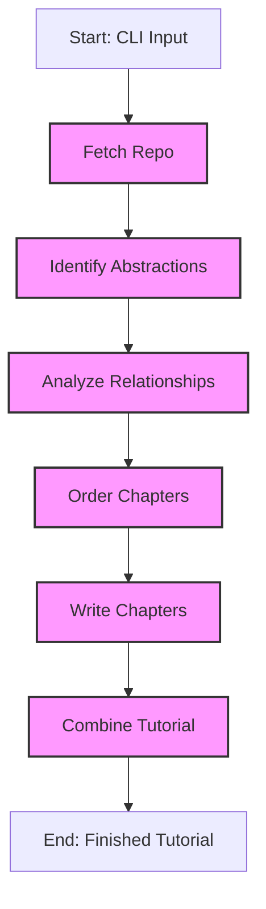

In the previous chapter, we explored how the Command-Line Interface collects your instructions and prepares a shared dictionary with all the necessary configuration. Now, let's dive into how the system actually transforms that raw configuration into a finished tutorial.

## What Problem Does the Pipeline Solve?

Generating a comprehensive tutorial from a codebase involves many distinct tasks:

- First, you need to fetch the code files from a source.
- Then identify the key concepts or "building blocks" in that code.
- Next, understand how these building blocks relate to each other.
- Determine the best order for teaching someone about these concepts.
- Generate detailed explanations for each concept.
- Finally, assemble everything into a coherent tutorial.

Each of these tasks requires different approaches and specialized logic. Implementing them as one massive function would create code that's difficult to understand, debug, and maintain.

This is where the **Tutorial Generation Pipeline** comes in. Think of it like an assembly line in a factory. Instead of having one worker trying to build an entire car from scratch, an assembly line has specialized stations, each focused on a specific part of the process. The partially completed car moves from station to station, with each worker contributing their piece.

Our Tutorial Generation Pipeline works the same way:

1. It breaks the complex task into distinct, manageable steps.
2. It ensures these steps execute in the correct order.
3. It ensures data flows properly from one step to the next.

## The Steps of the Pipeline

Our tutorial generation pipeline consists of six specialized nodes (think of them as the "stations" on our assembly line):

1. **FetchRepo (Codebase Crawler)**: Gets all the relevant code files from either GitHub or a local directory.
2. **IdentifyAbstractions (Abstraction Identifier)**: Uses AI to analyze the code and identify the key concepts or "abstractions" that should become chapter topics.
3. **AnalyzeRelationships (Relationship Analyzer)**: Examines how these abstractions interact and connect with each other, and generates a high-level project summary.
4. **OrderChapters (Chapter Orderer)**: Determines the most logical teaching sequence for these abstractions, creating the tutorial's table of contents.
5. **WriteChapters (Chapter Writer)**: Generates the actual Markdown content for each chapter, using AI to explain concepts clearly with examples and diagrams.
6. **CombineTutorial (Tutorial Combiner)**: Assembles all the generated chapters along with an index file and relationship diagram into the final tutorial package.

Each node has a highly specialized job, but they all work together through a shared data structure (our "shared" dictionary) that gets passed through the pipeline.

Here's a visualization of this pipeline:



## How the Pipeline Works Under the Hood

Our pipeline is built using a library called `pocketflow`, which provides a framework for creating sequences of connected nodes. Let's look at how this is implemented in the `flow.py` file:

```python
from pocketflow import Flow
from nodes import (
    FetchRepo,
    IdentifyAbstractions,
    AnalyzeRelationships,
    OrderChapters,
    WriteChapters,
    CombineTutorial
)

def create_tutorial_flow():
    """Creates and returns the codebase tutorial generation flow."""

    # 1. Create instances of each specialized worker (Node)
    fetch_repo = FetchRepo()
    identify_abstractions = IdentifyAbstractions(max_retries=5, wait=20)
    analyze_relationships = AnalyzeRelationships(max_retries=5, wait=20)
    order_chapters = OrderChapters(max_retries=5, wait=20)
    write_chapters = WriteChapters(max_retries=5, wait=20)
    combine_tutorial = CombineTutorial()

    # 2. Connect the nodes in sequence (like connecting stations on an assembly line)
    fetch_repo >> identify_abstractions
    identify_abstractions >> analyze_relationships
    analyze_relationships >> order_chapters
    order_chapters >> write_chapters
    write_chapters >> combine_tutorial

    # 3. Create the overall Flow, specifying where it starts
    tutorial_flow = Flow(start=fetch_repo)

    return tutorial_flow
```

Let's break down what's happening here:

### 1. Importing the Necessary Components

The first part of the file imports two essential things:
- The `Flow` class from `pocketflow`, which is the framework for creating our pipeline
- All our specialized node classes from `nodes.py`, where each node's logic is defined

### 2. Creating Node Instances

```python
fetch_repo = FetchRepo()
identify_abstractions = IdentifyAbstractions(max_retries=5, wait=20)
# ... and so on
```

This section creates an instance of each node class. Notice that most nodes have `max_retries=5, wait=20` parameters. This is an important reliability feature: if a node encounters an error (like a network issue or AI service timeout), it will automatically retry up to 5 times, waiting 20 seconds between attempts.

### 3. Connecting the Nodes

```python
fetch_repo >> identify_abstractions
identify_abstractions >> analyze_relationships
# ... and so on
```

This is where the magic happens! The `>>` operator (provided by `pocketflow`) connects the nodes in sequence. `A >> B` means "after Node A finishes, start Node B and give it access to the results that Node A produced."

This syntax creates a clear visual representation of the pipeline flow right in the code itself.

### 4. Creating the Flow

```python
tutorial_flow = Flow(start=fetch_repo)
```

Finally, we create a `Flow` object, telling it which node is the starting point. This creates our complete pipeline, ready to be executed.

### Running the Pipeline

Back in `main.py` (from Chapter 1), after we've set up the shared dictionary, we start the pipeline:

```python
# Create the flow instance
tutorial_flow = create_tutorial_flow()

# Run the flow with the shared dictionary
tutorial_flow.run(shared)
```

When `tutorial_flow.run(shared)` is called:

1. The `shared` dictionary is passed to the first node (`fetch_repo`).
2. `fetch_repo` does its job (fetching code files) and adds its results to the `shared` dictionary.
3. The updated `shared` dictionary is passed to the next node (`identify_abstractions`).
4. This process continues until all nodes have executed in sequence.
5. The final `shared` dictionary contains all the results, including the path to the generated tutorial.

## The Role of the `shared` Dictionary

You might have noticed that the pipeline doesn't explicitly pass data between nodes. Instead, it relies on the `shared` dictionary that we created in the CLI.

Think of the `shared` dictionary like a conveyor belt in our assembly line. Each station (node) takes what it needs from the conveyor belt, does its work, and then places its output back on the conveyor belt for the next station to use.

Here's a simplified example of how the `shared` dictionary evolves as it passes through our pipeline:

1. **Initial state** (from CLI):
   ```python
   shared = {
       "repo_url": "https://github.com/example/repo",
       "output_dir": "output",
       # ... other configuration ...
       "files": [],             # Empty placeholder
       "abstractions": [],      # Empty placeholder
       "relationships": {},     # Empty placeholder
       # ... other placeholders ...
   }
   ```

2. **After FetchRepo**:
   ```python
   shared = {
       # ... original configuration ...
       "files": [               # Now filled with content!
           ("main.py", "import os\n..."),
           ("utils.py", "def helper():\n..."),
           # ... other files ...
       ],
       # ... other placeholders still empty ...
   }
   ```

3. **After IdentifyAbstractions**:
   ```python
   shared = {
       # ... original configuration ...
       "files": [ ... ],        # From FetchRepo
       "abstractions": [        # Now filled with concepts!
           {"name": "CLI", "description": "...", "files": [0]},
           {"name": "Pipeline", "description": "...", "files": [1, 2]},
           # ... other abstractions ...
       ],
       # ... other placeholders still empty ...
   }
   ```

And so on, with each node adding its results to the `shared` dictionary until we have our complete tutorial.

This approach has several advantages:
- Each node can focus solely on its specific task
- Nodes are decoupled from each other, making the system more maintainable
- The `shared` dictionary provides a centralized state that all nodes can access
- The entire pipeline state is contained in a single structure, making debugging easier

## Understanding Node Structure

While we won't dive deep into each node's implementation yet (that comes in later chapters), it's helpful to understand the basic structure that all nodes follow.

Each node in our pipeline typically has three key methods:

1. **`prep(self, shared)`**: Prepares for the main work by getting needed data from the `shared` dictionary.
2. **`exec(self, prep_res)`**: Executes the node's main logic using the prepared data.
3. **`post(self, shared, prep_res, exec_res)`**: Updates the `shared` dictionary with the results.

Here's a simplified example showing the structure of the `FetchRepo` node:

```python
class FetchRepo(Node):
    def prep(self, shared):
        # Get what we need from shared
        repo_url = shared.get("repo_url")
        local_dir = shared.get("local_dir")
        # ... get other configuration ...
        
        # Return what exec will need
        return {
            "repo_url": repo_url,
            "local_dir": local_dir,
            # ... other config ...
        }
        
    def exec(self, prep_res):
        # Get the data prepared by prep
        repo_url = prep_res["repo_url"]
        local_dir = prep_res["local_dir"]
        
        # Do the main work (fetch files)
        if repo_url:
            # Fetch from GitHub
            result = crawl_github_files(repo_url=repo_url, ...)
        else:
            # Fetch from local directory
            result = crawl_local_files(directory=local_dir, ...)
            
        # Convert result to the format we need
        files_list = list(result.get("files", {}).items())
        
        # Return the result for post to use
        return files_list
        
    def post(self, shared, prep_res, exec_res):
        # Store our result in shared for the next node
        shared["files"] = exec_res
```

This separation of concerns within each node helps make the code more maintainable and easier to reason about.

## Conclusion

The Tutorial Generation Pipeline is the orchestration engine of our codebase tutorial generator. By breaking down the complex process into specialized steps and connecting them in sequence, it transforms your initial instructions (via the CLI) into a complete, well-structured tutorial.

The pipeline's design follows several important software engineering principles:
- **Single Responsibility Principle**: Each node does one thing and does it well
- **Separation of Concerns**: The logic for different tasks is cleanly separated
- **Data Flow Architecture**: Information flows clearly from one step to the next
- **Error Resilience**: Retries and timeout mechanisms handle failures gracefully

In the next chapter, we'll explore the central nervous system of our pipeline: the Shared Flow State mechanism that allows data to flow between the nodes.

## Practice Exercises

### Exercise 1: Understanding Pipeline Data Flow

**Scenario**: Imagine we've just run our tutorial generator on a small project, and the pipeline has reached the `OrderChapters` node. The `shared` dictionary currently has the following keys and values:

```python
shared = {
    "repo_url": "https://github.com/example/small-project",
    "output_dir": "output/small-project",
    "files": [("main.py", "..."), ("utils.py", "..."), ("model.py", "...")],
    "abstractions": [
        {"name": "Entry Point", "description": "...", "files": [0]},
        {"name": "Utilities", "description": "...", "files": [1]},
        {"name": "Data Model", "description": "...", "files": [2]}
    ],
    "relationships": {
        "summary": "This project is a simple data processor...",
        "details": [
            {"from": 0, "to": 1, "label": "Uses"},
            {"from": 0, "to": 2, "label": "Creates"},
            {"from": 1, "to": 2, "label": "Validates"}
        ]
    },
    "chapter_order": [],
    "chapters": [],
    "final_output_dir": None
}
```

**Questions**:
1. What node added the content to `shared["files"]`?
2. What node added the content to `shared["abstractions"]`?
3. What node added the content to `shared["relationships"]`?
4. Which keys are still empty, and which nodes will fill them?
5. What might a logical `chapter_order` be, based on the relationships?

<details>
<summary>Example Answers</summary>

1. The `FetchRepo` (Codebase Crawler) node added the content to `shared["files"]`.
2. The `IdentifyAbstractions` (Abstraction Identifier) node added the content to `shared["abstractions"]`.
3. The `AnalyzeRelationships` (Relationship Analyzer) node added the content to `shared["relationships"]`.
4. Empty keys: `chapter_order`, `chapters`, and `final_output_dir`. These will be filled by `OrderChapters`, `WriteChapters`, and `CombineTutorial` respectively.
5. A logical `chapter_order` might be `[0, 1, 2]`, which would create a tutorial that first explains the Entry Point, then the Utilities it uses, and finally the Data Model that both work with.
</details>

### Exercise 2: Extending the Pipeline

**Scenario**: You want to enhance the tutorial generator to add a spell-checking step that ensures proper grammar and spelling in the generated tutorial.

**Task**: Implement a new node called `SpellCheckTutorial` that would run after `WriteChapters` but before `CombineTutorial`.

1. Write a skeleton of this node following the standard `prep`, `exec`, `post` pattern.
2. Modify the `create_tutorial_flow()` function to include your new node in the correct position.
3. What keys in the `shared` dictionary would your node read from and potentially modify?

<details>
<summary>Example Solution</summary>

```python
# 1. New node skeleton
class SpellCheckTutorial(Node):
    def prep(self, shared):
        # We need to read the generated chapters to spell check them
        chapters_content = shared["chapters"]
        language = shared.get("language", "english")
        
        return {
            "chapters_content": chapters_content,
            "language": language
        }
    
    def exec(self, prep_res):
        chapters_content = prep_res["chapters_content"]
        language = prep_res["language"]
        
        # Initialize a list to store corrected chapters
        corrected_chapters = []
        
        # Process each chapter
        for chapter in chapters_content:
            # In a real implementation, this would use a spell checking library
            # For this example, we'll just simulate the process
            corrected_chapter = self._spell_check_text(chapter, language)
            corrected_chapters.append(corrected_chapter)
        
        return corrected_chapters
    
    def post(self, shared, prep_res, exec_res):
        # Replace the chapters with our spell-checked versions
        shared["chapters"] = exec_res
    
    def _spell_check_text(self, text, language):
        # Dummy implementation - in reality, this would use a spell checking library
        print(f"Spell checking chapter in {language}...")
        return text  # Just return the original for this example
```

```python
# 2. Modified create_tutorial_flow function
def create_tutorial_flow():
    # Create instances of each node
    fetch_repo = FetchRepo()
    identify_abstractions = IdentifyAbstractions(max_retries=5, wait=20)
    analyze_relationships = AnalyzeRelationships(max_retries=5, wait=20)
    order_chapters = OrderChapters(max_retries=5, wait=20)
    write_chapters = WriteChapters(max_retries=5, wait=20)
    spell_check_tutorial = SpellCheckTutorial()  # Our new node
    combine_tutorial = CombineTutorial()

    # Connect the nodes in sequence
    fetch_repo >> identify_abstractions
    identify_abstractions >> analyze_relationships
    analyze_relationships >> order_chapters
    order_chapters >> write_chapters
    write_chapters >> spell_check_tutorial  # Insert our new node here
    spell_check_tutorial >> combine_tutorial

    # Create the flow
    tutorial_flow = Flow(start=fetch_repo)
    
    return tutorial_flow
```

3. The node would read from `shared["chapters"]` (the generated Markdown content for each chapter) and modify this same key, replacing the original chapters with spell-checked versions.

</details>

### Exercise 3: Debugging the Pipeline

**Scenario**: You're testing the tutorial generator on a complex project, and the process fails during the `IdentifyAbstractions` stage with an error message:

```
Error: LLM Output is not a list
```

Looking at the logs, you find that the Large Language Model (LLM) returned a malformed response that couldn't be parsed as a YAML list of abstractions.

**Task**: As a developer maintaining this system, what would you do to:
1. Implement better error handling for this specific case
2. Make the system more robust against similar failures in the future

Think about:
- How could the node validate the LLM's output better?
- What fallback mechanisms could you implement?
- How would you improve the prompt to the LLM to get more reliable responses?

<details>
<summary>Example Solution</summary>

Here's how we could improve the system:

1. **Better Error Handling**:
   ```python
   def exec(self, prep_res):
       # ... existing code ...
       
       try:
           yaml_str = response.strip().split("```yaml")[1].split("```")[0].strip()
           abstractions = yaml.safe_load(yaml_str)
       except (IndexError, yaml.YAMLError) as e:
           # More specific error handling for YAML parsing issues
           print(f"Failed to parse LLM response as YAML: {e}")
           print(f"Raw response was: {response[:100]}...")  # Log part of the raw response
           
           # Attempt recovery - try an alternative parsing approach
           abstractions = self._attempt_alternative_parsing(response)
           
           if not abstractions:
               raise ValueError(f"Could not parse LLM output as abstractions list: {e}")
    
    def _attempt_alternative_parsing(self, response):
        """Fallback method to try alternative parsing approaches"""
        # Try to extract any JSON-like structure
        try:
            import re
            # Look for anything that might be a list in square brackets
            match = re.search(r'\[\s*\{.*\}\s*\]', response, re.DOTALL)
            if match:
                import json
                return json.loads(match.group(0))
        except:
            pass
            
        # If all else fails, return None
        return None
   ```

2. **System Robustness Improvements**:
   
   a. **Improve the prompt**:
   ```python
   prompt = f"""
   For the project `{project_name}`:
   
   Codebase Context:
   {context}
   
   Analyze the codebase context and identify the top 5-{max_abstraction_num} core most important abstractions.
   
   CRITICAL: Your response MUST follow this EXACT format - a YAML list where each item has exactly these three fields:
   - name: A concise name for the abstraction
   - description: A beginner-friendly explanation of what it is
   - file_indices: A list of relevant file indices as integers
   
   Example output format:
   ```yaml
   - name: Query Processing
     description: Explains what the abstraction does. It's like a central dispatcher routing requests.
     file_indices:
       - 0
       - 3
   - name: Query Optimization
     description: Another core concept, similar to a blueprint for objects.
     file_indices:
       - 5
   ```
   
   YOUR RESPONSE MUST START WITH ```yaml AND END WITH ``` WITH NO OTHER TEXT BEFORE OR AFTER.
   """
   ```
   
   b. **Implement a retry mechanism with prompt refinement**:
   ```python
   # In the Node base class or a utility function
   def call_llm_with_retry(self, prompt, use_cache=True, max_retries=3):
       """Call LLM with graduated retry logic"""
       for attempt in range(max_retries):
           try:
               response = call_llm(prompt, use_cache=use_cache and attempt == 0)
               
               # Try to parse - if this succeeds, return the result
               yaml_str = response.strip().split("```yaml")[1].split("```")[0].strip()
               result = yaml.safe_load(yaml_str)
               
               # Validate basic structure
               if isinstance(result, list) and all(isinstance(item, dict) for item in result):
                   return result
                   
           except Exception as e:
               print(f"Attempt {attempt+1} failed: {e}")
               
               # On failure, refine the prompt to be more explicit
               if attempt < max_retries - 1:
                   prompt += "\n\nYOUR PREVIOUS RESPONSE WAS INVALID. Please STRICTLY follow the YAML format shown above with EXACTLY the fields requested. This is critical."
       
       # If we get here, all retries failed
       raise ValueError(f"Failed to get valid response after {max_retries} attempts")
   ```
   
   c. **Add a simple fallback mode**:
   ```python
   def exec(self, prep_res):
       # ... try normal processing first ...
       
       try:
           # Normal processing path
           # ...
       except Exception as e:
           print(f"Error in normal processing: {e}")
           print("Attempting fallback mode with simplified prompt...")
           
           # Fallback to a much simpler approach - just extract file names as abstractions
           fallback_abstractions = []
           for i, (path, _) in enumerate(shared["files"]):
               name = os.path.basename(path).replace(".py", "").replace("_", " ").title()
               fallback_abstractions.append({
                   "name": name,
                   "description": f"Component defined in {path}",
                   "files": [i]
               })
           
           print(f"Generated {len(fallback_abstractions)} fallback abstractions")
           return fallback_abstractions
   ```

These improvements would make the system much more robust against LLM output parsing issues, with several layers of recovery mechanisms.
</details>

[Next Chapter: Shared Flow State](03_shared_flow_state_.md)

---

<sub><sup>Generated by [AI Codebase Knowledge Builder](https://github.com/The-Pocket/Tutorial-Codebase-Knowledge).</sup></sub>
