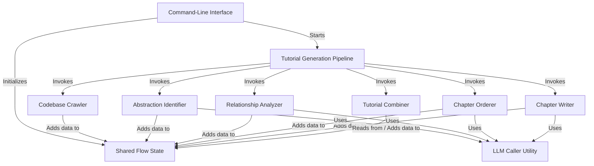

The **AI Codebase Knowledge Builder** is a system designed to automatically generate a *beginner-friendly tutorial* for a software codebase. It works by processing code files through a defined **pipeline**, identifying core **abstractions** or concepts, analyzing their **relationships**, determining a logical **chapter order**, **writing tutorial content** for each concept, and **combining** everything into markdown files. Data and results are passed between the pipeline's steps using a central **shared state**.


## Visual Overview



## Chapters

1. [Command-Line Interface
](01_command_line_interface_.md)
2. [Tutorial Generation Pipeline
](02_tutorial_generation_pipeline_.md)
3. [Shared Flow State
](03_shared_flow_state_.md)
4. [Codebase Crawler
](04_codebase_crawler_.md)
5. [Abstraction Identifier
](05_abstraction_identifier_.md)
6. [Relationship Analyzer
](06_relationship_analyzer_.md)
7. [Chapter Orderer
](07_chapter_orderer_.md)
8. [Chapter Writer
](08_chapter_writer_.md)
9. [Tutorial Combiner
](09_tutorial_combiner_.md)
10. [LLM Caller Utility
](10_llm_caller_utility_.md)

---

<sub><sup>Generated by [AI Codebase Knowledge Builder](https://github.com/The-Pocket/Tutorial-Codebase-Knowledge).</sup></sub>
````