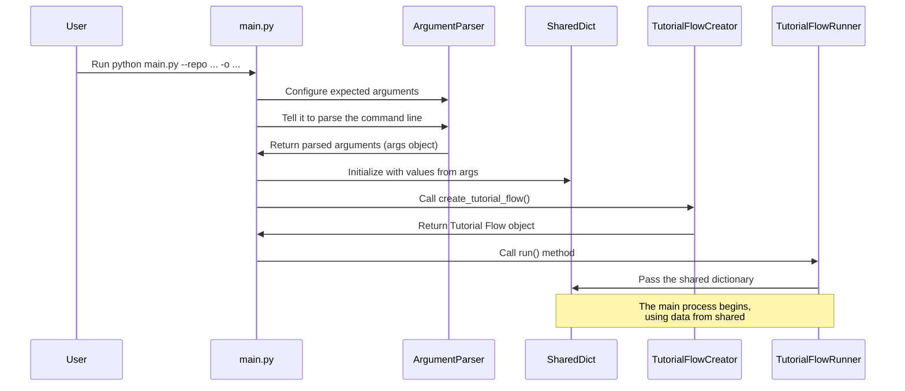

Welcome to the tutorial for understanding the PocketFlow-Tutorial-Codebase-Knowledge project! This project helps you automatically generate tutorials from a codebase. But how do you tell the project _which_ codebase to analyze and _how_ you want the tutorial to be generated? That's where the Command-Line Interface, or CLI, comes in.

Think of the CLI as the control panel for our tutorial generator. Instead of clicking buttons in a graphical window, you type simple text commands into a terminal or command prompt. This is a very common way to interact with software, especially developer tools!

## What Problem Does the CLI Solve?

Imagine you have a fantastic piece of code, maybe a small application or a library, and you want to create a tutorial explaining how it works. Doing this manually takes a lot of time! This project automates that. But it needs some crucial information from you to get started:

1.  **Where is the code?** Is it on GitHub, or is it a folder on your computer?
2.  **What do you want to name the project?**
3.  **Where should the generated tutorial files go?**
4.  **Are there any specific files or folders to _ignore_ (like test files or build directories)?**
5.  **What language should the tutorial be in?**

The Command-Line Interface is the standard way for the user to provide _exactly_ this kind of input to the program before it starts running.

**Our Use Case:** The primary goal of the CLI is to let you, the user, specify the source of the code (a GitHub URL or local path) and other settings, then kick off the entire tutorial generation process.

## How to Use the Command-Line Interface

Interacting with a program via the command line usually follows a pattern:

```bash
python your_script_name.py --argument1 value1 --argument2 value2 ...
```

In our case, the main script is `main.py`. So, you'll typically run it like this:

```bash
python main.py [options]
```

The `[options]` are where you provide the information like the code location, output directory, etc. These are called **command-line arguments** or **flags**.

The `main.py` script uses a standard Python library called `argparse` to handle these arguments. `argparse` makes it easy to define what arguments your script accepts, what type of values they expect (like text or numbers), and even provides help messages if you type something wrong.

Here are the most important arguments you'll use with `main.py`:

- **`--repo <URL>`**: Specifies the URL of a _public_ GitHub repository.
- **`--dir <PATH>`**: Specifies the path to a _local_ directory containing the code.
  - **Important:** You **must** provide either `--repo` or `--dir`, but not both. The CLI needs to know where to find your code!
- **`-o <PATH>` or `--output <PATH>`**: Specifies the directory where the generated tutorial files will be saved. If you don't provide this, it defaults to a folder named `output` in the same directory you run the script from.
- **`-n <NAME>` or `--name <NAME>`**: Gives a specific name to your project. If you omit this, the script will try to figure out a name based on the repository URL or directory path.
- **`--language <LANGUAGE>`**: Sets the language for the generated tutorial. The default is `english`. You could potentially specify other languages if the LLM (Large Language Model) component supports them.
- **`--no-cache`**: By default, the project might cache responses from the LLM to save time and cost on future runs. Adding this flag _disables_ that caching.

There are other arguments too, for more fine-grained control:

- **`-t <TOKEN>` or `--token <TOKEN>`**: Provide a GitHub personal access token. This is important if you're analyzing a private repository or if you expect to make many requests to GitHub (to avoid rate limits). You can also set a `GITHUB_TOKEN` environment variable instead.
- **`-i <PATTERN1> <PATTERN2> ...` or `--include <PATTERN1> <PATTERN2> ...`**: Specify file patterns (like `*.py` for all Python files) that _should_ be included. By default, it includes common code file types.
- **`-e <PATTERN1> <PATTERN2> ...` or `--exclude <PATTERN1> <PATTERN2> ...`**: Specify file patterns that _should_ be excluded (like `tests/*` to ignore the `tests` directory). By default, it excludes common test, build, and config directories.
- **`-s <SIZE>` or `--max-size <SIZE>`**: Sets the maximum size (in bytes) for a file to be considered. Files larger than this limit are ignored. Defaults to 100,000 bytes (about 100 KB). Large files can be difficult for the analysis steps.
- **`--max-abstractions <NUMBER>`**: Controls the maximum number of key concepts (abstractions) the tool will try to identify and write chapters about. Defaults to 10.

### Example Usage

Let's say you want to generate a tutorial for a public GitHub repository located at `https://github.com/someuser/my-project` and save the output to a folder named `my_project_tutorial`. You'd open your terminal, navigate to the directory where you have `main.py`, and run:

```bash
python main.py --repo https://github.com/someuser/my-project --output my_project_tutorial
```

If the code was in a local folder called `~/Documents/my-local-project`, you would use:

```bash
python main.py --dir ~/Documents/my-local-project --output my_project_tutorial --name MyLocalProjectTutorial
```

To generate the tutorial in Spanish and disable caching for a local project:

```bash
python main.py --dir ~/Documents/my-local-project --language spanish --no-cache
```

(Assuming `output` is acceptable as the output directory).

When you run one of these commands, you'll see some initial messages printed to your terminal, like which codebase it's starting with and the language selected. This tells you the program has received your instructions and is starting the process.

## How the CLI Works Under the Hood (`main.py`)

The `main.py` file is surprisingly simple! Its main job is just to get the user's instructions and pass them along to the core logic.

Here's a simplified look at what happens inside `main.py` when you run it:

1.  **Setup:** It imports necessary tools like `argparse` for handling command-line arguments and `os` for interacting with the operating system (like reading environment variables). It also loads environment variables, potentially including a GitHub token.

    ```python
    import dotenv
    import os
    import argparse
    # Import the function that will create the main process pipeline
    from flow import create_tutorial_flow

    # Load environment variables from a .env file if it exists
    dotenv.load_dotenv()
    ```

    _Explanation:_ This part gets everything ready. `dotenv` helps load settings from a `.env` file, which is a common way to store configuration like API keys locally without putting them directly in the code. `argparse` is the library we'll use to read your command.

2.  **Define Arguments:** It sets up `argparse` to understand what arguments (`--repo`, `--dir`, `-o`, etc.) are expected, what they mean (the `help` text), and what kind of values they take.

    ```python
    def main():
        # Create an ArgumentParser object. This will handle parsing arguments.
        parser = argparse.ArgumentParser(description="Generate a tutorial for a GitHub codebase or local directory.")

        # Define which arguments the script accepts
        # This group ensures ONLY --repo OR --dir is provided
        source_group = parser.add_mutually_exclusive_group(required=True)
        source_group.add_argument("--repo", help="URL of the public GitHub repository.")
        source_group.add_argument("--dir", help="Path to local directory.")

        # Add other arguments like output, name, etc.
        parser.add_argument("-o", "--output", default="output", help="Base directory for output (default: ./output).")
        parser.add_argument("--language", default="english", help="Language for the generated tutorial (default: english)")
        # ... many other arguments added here ...
    ```

    _Explanation:_ The `argparse.ArgumentParser` is like setting up a form. Each `parser.add_argument()` call adds a field to the form, defining its name (`--repo`, `-o`), what kind of input it needs (`help` text), and any default values (`default="output"`). `add_mutually_exclusive_group` is used to enforce the rule that you provide _either_ `--repo` or `--dir`, but not both.

3.  **Parse Arguments:** When you run the script, `parser.parse_args()` reads the command you typed, matches it against the defined arguments, and collects all the values you provided into a single object, usually named `args`.

    ```python
    # Inside the main() function, after adding all arguments:
    args = parser.parse_args()
    ```

    _Explanation:_ This line is where `argparse` does its magic. It looks at `sys.argv` (which contains the parts of the command you typed) and figures out which value belongs to which argument. The result is stored in the `args` object. For example, if you ran `python main.py --output my_folder`, `args.output` would be `"my_folder"`.

4.  **Prepare Shared Data:** The script then takes the values from the `args` object and organizes them into a Python dictionary called `shared`. This `shared` dictionary is very important because it will hold _all_ the configuration information _and_ later, all the intermediate results as the tutorial generation process runs.

    ```python
    # Inside main() function, after parsing args:
    # Initialize the shared dictionary with inputs from args
    shared = {
        "repo_url": args.repo,
        "local_dir": args.dir,
        "output_dir": args.output,
        "language": args.language,
        # ... populate other keys from args ...

        # Initialize placeholders for outputs
        "files": [],
        "abstractions": [],
        "chapters": [],
        # ... other placeholder keys ...
    }
    ```

    _Explanation:_ This dictionary is like the project's central notebook. All the starting instructions from the user (`args.repo`, `args.output`, etc.) are written down here. It also creates empty sections (`"files": []`, `"abstractions": []`) where later steps of the process will record their results. You'll learn more about this central data structure in the [Shared Flow State](03_shared_flow_state_.md) chapter.

5.  **Start the Process:** Finally, the script calls `create_tutorial_flow()` to build the sequence of steps needed to generate the tutorial, and then calls `.run(shared)` on that sequence, passing the `shared` dictionary. This kicks off the entire process!

    ```python
    # Inside main() function, after preparing shared:
    # Print a starting message
    print(f"Starting tutorial generation for: {args.repo or args.dir} in {args.language.capitalize()} language")

    # Create the flow instance (the sequence of steps)
    tutorial_flow = create_tutorial_flow()

    # Run the flow, passing the shared data dictionary
    tutorial_flow.run(shared)
    ```

    _Explanation:_ The `create_tutorial_flow()` function (defined elsewhere, in `flow.py`) acts like building an assembly line. It sets up all the different machines (or "nodes" in this project's terminology) in the correct order. The `tutorial_flow.run(shared)` command then starts the assembly line, feeding it the `shared` dictionary so it knows what codebase to use, where to save output, etc. We'll dive deep into this "assembly line" in the next chapter, [Tutorial Generation Pipeline](02_tutorial_generation_pipeline_.md).

Here's a simple diagram showing this flow:



## Conclusion

The Command-Line Interface, handled by `main.py` and the `argparse` library, is the entry point of the PocketFlow-Tutorial-Codebase-Knowledge project. It provides a structured way for you to give the program all the necessary instructions – like where to find the code, where to put the output, and what language to use – before the tutorial generation begins. These instructions are collected into a `shared` dictionary, which acts as the central hub of information for the entire process.

Now that we know how to start the process and provide inputs via the CLI, the next logical step is to understand what happens _after_ you hit enter. The next chapter will explore the sequence of operations that the program performs to go from your command-line input to a finished tutorial.

[Next Chapter: Tutorial Generation Pipeline](02_tutorial_generation_pipeline_.md)

<sup>Generated by [AI Codebase Knowledge Builder](https://github.com/The-Pocket/Tutorial-Codebase-Knowledge).</sup>

---

###### References

[[1]](https://github.com/The-Pocket/PocketFlow-Tutorial-Codebase-Knowledge/blob/86b22475977019d4147523aa0a1c8049625db5e0/main.py)
