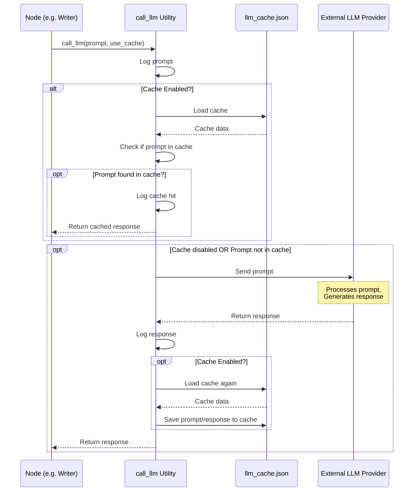

Welcome to the final chapter covering the core concepts of the PocketFlow-Tutorial-Codebase-Knowledge project!

In the previous chapters, we've followed the tutorial generation journey:

- We saw how the [Command-Line Interface](01_command_line_interface_.md) gets your instructions.
- The [Tutorial Generation Pipeline](02_tutorial_generation_pipeline_.md) orchestrates the steps, managing data in the [Shared Flow State](03_shared_flow_state_.md).
- The [Codebase Crawler](04_codebase_crawler_.md) fetched the code.
- The [Abstraction Identifier](05_abstraction_identifier_.md) found key concepts.
- The [Relationship Analyzer](06_relationship_analyzer_.md) mapped connections and summarized the project.
- The [Chapter Orderer](07_chapter_orderer_.md) decided the best learning sequence.
- And the [Chapter Writer](08_chapter_writer_.md) generated the Markdown for each chapter, using the concepts, code, and relationships identified earlier.
- Finally, the [Tutorial Combiner](09_tutorial_combiner_.md) assembled everything into the final tutorial files.

You might have noticed a recurring theme in many of these steps (like the Identifier, Analyzer, Orderer, and Writer): they all relied on an external helper – a Large Language Model (LLM) – to perform the complex tasks of understanding, analyzing, and writing about code.

But how do these different parts of our project actually _talk_ to the LLM? Do they each need to know the technical details of connecting to Google Gemini, OpenAI, Anthropic, or whatever AI service is being used? That would make the project much harder to manage and update!

This is exactly the problem solved by the **LLM Caller Utility**.

## What Problem Does the LLM Caller Utility Solve?

Imagine our tutorial generation pipeline is a busy office with different teams: the "File Fetchers" team, the "Concept Finders" team, the "Relationship Mappers" team, and the "Chapter Writers" team. All these teams sometimes need to consult a highly knowledgeable expert (the LLM) who speaks a complex, technical language (the AI service API).

Instead of each team learning how to directly call, format requests for, handle errors from, and manage costs/speed of this expert, they all go through a single, dedicated **interpreter**. This interpreter knows how to formulate the question for the expert, send it, understand the expert's reply, and give it back to the team in a simple, understandable format. This interpreter also keeps notes (a cache) so that if someone asks the exact same question again, they can provide the answer instantly without bothering the expert or incurring extra cost.

The LLM Caller Utility acts as this central interpreter. It provides a single, consistent way for _any_ part of our project pipeline to interact with an external LLM, hiding all the complexity of the specific AI service being used, managing connection details, and handling caching.

**Our Use Case:** The primary role of the `call_llm` utility function is to be the standard gateway for sending text prompts to a Large Language Model and receiving text responses, handling the underlying communication and caching mechanisms.

This makes the nodes simpler, as they only need to worry about _what_ to ask the LLM (the prompt) and _what_ to do with the answer (the response), not _how_ to talk to the LLM service itself.

## The Core Task: Asking the LLM

At its heart, interacting with an LLM in this project comes down to one basic operation:

1.  You have a block of text you want to send (the **prompt**). This prompt contains instructions for the LLM, context (like code snippets), and the desired output format.
2.  You send this prompt to the LLM.
3.  You receive a block of text back (the **response**). This response is the LLM's output based on your prompt.

The LLM Caller Utility provides a simple Python function to do exactly this.

## Using the `call_llm` Utility

The main way any node or part of the project interacts with an LLM is by calling the `call_llm` function.

You can find this function defined in the file `utils/call_llm.py`.

Its most basic usage looks like this:

```python
# Example of using the LLM Caller Utility
from utils.call_llm import call_llm

# The 'prompt' contains instructions, context, etc.
my_prompt = "Explain the concept of caching in simple terms."

# Call the utility function
# It sends the prompt and waits for the response
llm_response = call_llm(my_prompt)

# 'llm_response' now holds the text response from the LLM
print("LLM says:", llm_response)
```

This is the simplified view seen by nodes like [Abstraction Identifier](05_abstraction_identifier_.md) or [Chapter Writer](08_chapter_writer_.md). They construct a complex prompt based on the data they have from the `shared` dictionary, pass it to `call_llm`, and get the result back. They don't need to know if it used Google Gemini, OpenAI, or if the answer came straight from the cache!

## Key Concepts & Features

The `call_llm` utility handles a few important things under the hood:

1.  **Abstracting the LLM Service:** It contains the code needed to connect to a _specific_ LLM provider (like Google Gemini in the default configuration). If we wanted to switch to a different provider, we would ideally only need to change the code _inside_ `call_llm.py`, not in every node that uses it.
2.  **Handling API Keys and Configuration:** It reads necessary configuration like API keys and model names from environment variables (`.env` file or system environment), keeping this sensitive information out of the main code logic of the nodes.
3.  **Caching:** This is a major feature. Calling LLMs costs money and takes time. If the exact same prompt is sent multiple times (which can happen during testing, development, or even within a pipeline run if a node is retried), `call_llm` can store the prompt and its response in a local cache file (`llm_cache.json`). The next time that exact prompt is sent, it checks the cache first and returns the stored response instantly, saving time and cost.
4.  **Logging:** It logs every prompt sent and every response received to a log file (`logs/llm_calls_YYYYMMDD.log`). This is incredibly useful for debugging, understanding what prompts were sent, and seeing the raw responses from the LLM.

## How `call_llm` Works Under the Hood

Let's look at a simplified walkthrough of what happens when `call_llm(prompt, use_cache)` is called:

1.  The utility receives the `prompt` string and the `use_cache` boolean flag.
2.  It immediately logs the incoming `prompt` to the log file.
3.  If `use_cache` is `True`:
    - It tries to load the `llm_cache.json` file from disk.
    - It checks if the exact `prompt` string exists as a key in the loaded cache.
    - If found, it logs that it's returning from cache and immediately returns the cached `response` associated with that `prompt`. The process stops here.
4.  If `use_cache` is `False` or the prompt was not found in the cache:
    - It uses the configured LLM client (e.g., `google.genai.Client`) which reads settings like API keys and model names from environment variables.
    - It sends the `prompt` to the LLM provider using the client library.
    - It waits for the LLM provider to send back a `response`.
5.  Once the `response` is received (either from the LLM provider or from the cache):
    - It logs the `response` to the log file.
    - If `use_cache` is `True` (and the response wasn't already from the cache):
      - It loads the cache again (in case another process modified it while this call was happening).
      - It adds the current `prompt` and `response` pair to the cache dictionary.
      - It saves the updated cache dictionary back to the `llm_cache.json` file.
6.  Finally, it returns the `response` string.

Here is a simple sequence diagram showing this flow:



This diagram illustrates how the `call_llm` utility sits between the parts of our project that need AI capabilities (the "Caller" nodes) and the external AI service, managing the caching layer in between.

### Diving Deeper into the Code (`utils/call_llm.py`)

Let's look at snippets from `utils/call_llm.py` to see parts of this implementation.

The function definition and cache checking:

```python
# Simplified snippets from utils/call_llm.py

import json # Needed for cache
import os # Needed for files/env vars
import logging # Needed for logging

# ... logging setup ...
cache_file = "llm_cache.json" # Name of the cache file

def call_llm(prompt: str, use_cache: bool = True) -> str:
    # Log the prompt early
    logger.info(f"PROMPT: {prompt}")

    # Load cache if enabled
    if use_cache:
        cache = {}
        if os.path.exists(cache_file):
            try:
                with open(cache_file, "r", encoding="utf-8") as f:
                    cache = json.load(f)
            except Exception as e:
                # Log error but don't stop if cache fails
                logger.warning(f"Failed to load cache from {cache_file}: {e}")

        # Check if prompt is in cache
        if prompt in cache:
            logger.info(f"RESPONSE (cached): {cache[prompt]}")
            # Return response immediately from cache
            return cache[prompt]

    # Code continues here if cache is disabled or prompt not found
    # ... LLM API Call Logic ...
```

_Explanation:_ This first snippet shows the function signature, reading the `use_cache` flag, attempting to load the cache file, and checking if the incoming `prompt` is a key in the loaded `cache` dictionary. If it is, the cached response is returned.

The core interaction with the LLM service (using Google Gemini client as the default example):

```python
# Simplified snippets from utils/call_llm.py

# ... (previous code for logging, cache setup, and cache check) ...

    # Call the LLM if not in cache or cache disabled
    try:
        # The 'genai.Client' and 'client.models.generate_content'
        # are specific to the Google Gemini library.
        # Different libraries (OpenAI, Anthropic, etc.) would have different code here.
        client = genai.Client(api_key=os.getenv("GEMINI_API_KEY", ""))
        model = os.getenv("GEMINI_MODEL", "gemini-2.5-pro-exp-03-25") # Read model name from env

        # Send the prompt
        response = client.models.generate_content(model=model, contents=[prompt])
        response_text = response.text # Extract the text content from the response object

    except Exception as e:
         # If the LLM call fails, log the error and re-raise
         logger.error(f"LLM API call failed: {e}")
         raise # Stop the process or allow PocketFlow to retry the node


    # Code continues here after successful LLM call or if cache was used
    # ... Logging and Cache Update Logic ...
```

_Explanation:_ This snippet shows the part where the specific LLM client is initialized (reading the API key from the environment) and the `generate_content` method is called to send the `prompt` and get the result. Error handling is included to log and propagate API errors. If a different LLM provider was configured (via commented-out code in the actual file), this section would look different, but the `call_llm` interface remains the same for the calling nodes.

Finally, logging the response and updating the cache:

```python
# Simplified snippets from utils/call_llm.py

# ... (previous code for logging, cache check, and LLM API call) ...

    # If we reached here, we got a response (either from LLM or cache hit)
    # Log the response (if not already logged as cached)
    # The 'if prompt not in cache' check ensures we don't double log if cache was hit earlier
    # but the cache check was inside the 'if use_cache' block.
    # A simpler approach might log before returning from cache.
    # In the actual code, the cache hit log is distinct.
    # Let's simplify the flow for this example:

    # Log the response (happens after getting response, before returning from cache or LLM call)
    # (Actual logging happens earlier before cache return and after LLM call)
    # logger.info(f"RESPONSE: {response_text}") # This line is in the actual code after LLM call

    # Update cache if enabled AND we actually called the LLM (i.e., wasn't a cache hit)
    # The check `if use_cache and prompt not in cache` in the actual code ensures this
    if use_cache and prompt not in cache: # Add to cache only if it was a fresh LLM call
        # Load cache again just before saving (defensive)
        cache = {}
        if os.path.exists(cache_file):
            try:
                with open(cache_file, "r", encoding="utf-8") as f:
                    cache = json.load(f)
            except Exception as e:
                 logger.warning(f"Failed to reload cache before saving: {e}")
                 # Continue saving, potentially overwriting if load failed

        # Add the new entry
        cache[prompt] = response_text
        try:
            # Save the updated cache
            with open(cache_file, "w", encoding="utf-8") as f:
                json.dump(cache, f, indent=4) # Use indent for readability
        except Exception as e:
            logger.error(f"Failed to save cache to {cache_file}: {e}")

    # Finally, return the response text
    return response_text

# ... (rest of the file, including test section __main__) ...
```

_Explanation:_ After getting a response (either from the LLM service or directly from the cache), the response is logged. If caching was enabled _and_ the response was not already in the cache (meaning the LLM service was actually called), the prompt-response pair is added to the `cache` dictionary, and the cache file is saved back to disk.

This setup provides a robust and consistent way to interact with LLMs throughout the project, centralizing complex logic and benefiting from caching automatically.

## Inputs and Outputs of `call_llm`

We can summarize the `call_llm` function's interaction:

| Input Parameters      | Output Return Value               |
| :-------------------- | :-------------------------------- |
| `prompt` (string)     | The LLM's response (string)       |
| `use_cache` (boolean) | (Errors are raised as exceptions) |

The function takes the text `prompt` to send to the LLM and a boolean `use_cache` flag indicating whether to check and update the local cache. It returns the LLM's response as a string. Any errors during API communication or parsing would typically result in an exception being raised.

## Where is `call_llm` Used?

As mentioned earlier, several core nodes in the pipeline rely on `call_llm` to perform their tasks that require AI reasoning or generation:

- [Abstraction Identifier](05_abstraction_identifier_.md): Uses `call_llm` to ask the LLM to identify core concepts from code files.
- [Relationship Analyzer](06_relationship_analyzer_.md): Uses `call_llm` to ask the LLM to analyze interactions between concepts and write a project summary.
- [Chapter Orderer](07_chapter_orderer_.md): Uses `call_llm` to ask the LLM to determine the best sequence of concepts for a tutorial.
- [Chapter Writer](08_chapter_writer_.md): Uses `call_llm` multiple times (once per chapter) to ask the LLM to write the detailed Markdown content for each chapter.

By centralizing the LLM interaction logic in `call_llm`, these nodes can focus on _preparing the right prompt_ and _processing the response_ without worrying about the underlying API calls, authentication, or caching details.

## Conclusion

The LLM Caller Utility, specifically the `call_llm` function in `utils/call_llm.py`, is a foundational component of the PocketFlow-Tutorial-Codebase-Knowledge project. It serves as the dedicated interpreter, providing a simple and consistent interface for all parts of the pipeline to interact with external Large Language Models.

By abstracting away the complexities of connecting to different AI services, managing API keys, and implementing caching and logging, `call_llm` simplifies the design of the various pipeline nodes and makes the project more robust and easier to maintain or adapt to different LLM providers in the future. The built-in caching mechanism also helps save time and cost on repeated LLM calls.

Understanding `call_llm` helps you see how the project effectively harnesses the power of AI by wrapping the core interaction in a reusable, efficient utility.

This chapter concludes our exploration of the core concepts and components of the tutorial generation pipeline. You now have a solid understanding of how the project goes from command-line input and raw code files to a structured, generated tutorial.

---

<sub><sup>Generated by [AI Codebase Knowledge Builder](https://github.com/The-Pocket/Tutorial-Codebase-Knowledge).</sup></sub> <sub><sup>**References**: [[1]](https://github.com/The-Pocket/PocketFlow-Tutorial-Codebase-Knowledge/blob/86b22475977019d4147523aa0a1c8049625db5e0/utils/call_llm.py)</sup></sub>
