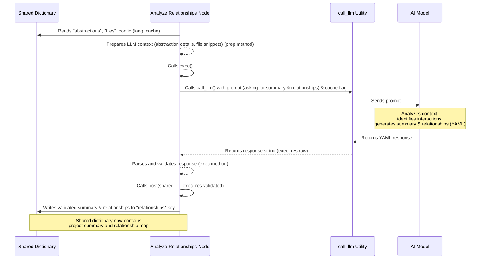

Welcome back to the tutorial series for PocketFlow-Tutorial-Codebase-Knowledge!

In our previous steps, we've built a solid foundation:

- [Chapter 4: Codebase Crawler](04_codebase_crawler_.md) gathered all the relevant code files from your project into the central `shared` dictionary (`shared["files"]`).
- [Chapter 5: Abstraction Identifier](05_abstraction_identifier_.md) analyzed these files and identified the core concepts or "abstractions" within your codebase, storing them as a structured list in `shared["abstractions"]`.

Now we have a list of the main building blocks of the project. But simply knowing the blocks isn't enough to understand the whole system! We need to know how they connect, how they talk to each other, and how information flows between them.

This is where the **Relationship Analyzer** comes in.

## What Problem Does the Relationship Analyzer Solve?

Imagine you have a box of LEGOs (your abstractions). You know you have a "red brick," a "blue plate," and a "minifigure." That's useful information, but it doesn't tell you how to build the spaceship on the box! To understand the spaceship, you need to see the _relationships_: the red bricks connect to the blue plate, the minifigure sits on the blue plate, etc.

In a codebase, the identified abstractions (like a `DatabaseManager`, a `UserAuthenticator`, and an `APIRouter`) don't exist in isolation. The `APIRouter` probably uses the `UserAuthenticator` to check who's making a request, and both might interact with the `DatabaseManager`. Understanding these connections is crucial for understanding the project's architecture and how it actually works.

The challenge is automatically figuring out these connections by looking at the code and the identified abstractions. This is the job of the Relationship Analyzer.

**Our Use Case:** After the [Abstraction Identifier](05_abstraction_identifier_.md) finds the key concepts, the Relationship Analyzer component examines the code _again_ in the context of these concepts to understand how they interact, depend on each other, or communicate. This analysis helps create a high-level map of the project structure and generates a summary.

Think of the Relationship Analyzer like the systems engineer we mentioned in the description. Once the architect identifies the main parts of the building (foundation, plumbing, electrical), the systems engineer draws diagrams showing how the plumbing connects to the water source and drains, how the electrical system connects to the power grid and outlets, how the HVAC system connects to ductwork throughout the building, and so on. They map out the _flows_ and _connections_.

## The Analyzer's Role: The `AnalyzeRelationships` Node

In our tutorial generation pipeline ([Chapter 2](02_tutorial_generation_pipeline_.md)), the task of mapping these connections and summarizing the project is handled by the `AnalyzeRelationships` node. This node runs after `IdentifyAbstractions`.

The `AnalyzeRelationships` node's main responsibilities are to:

1.  **Read Abstractions and Files:** Get the list of identified abstractions (`shared["abstractions"]`) and the raw file data (`shared["files"]`) from the `shared` dictionary.
2.  **Analyze Interactions:** Use an AI model (the LLM) to analyze the relationship between the identified abstractions by examining the relevant code snippets. Does one abstraction call functions in another? Does it inherit from it? Does it pass data to it?
3.  **Determine Key Relationships:** Pinpoint the most significant interactions that are important for a beginner to understand the overall project structure. Simplify complex interactions into clear, simple labels. Ensure _every_ abstraction is included in at least one relationship to ensure the entire project map is covered.
4.  **Generate Project Summary:** Create a concise, beginner-friendly summary of what the overall project does.
5.  **Store Results:** Put the project summary and the list of identified relationships back into the `shared` dictionary.

## How `AnalyzeRelationships` Works Under the Hood

Let's look inside the `AnalyzeRelationships` node in `nodes.py` and see how it uses the `shared` dictionary and the `call_llm` utility ([Chapter 10](10_llm_caller_utility_.md)) to perform its analysis.

It follows the standard `prep`, `exec`, and `post` method structure:

1.  **`prep(self, shared)`:**

    - **Reads Inputs:** Reads the essential data from `shared`: the list of `abstractions` (which includes their names, descriptions, and relevant file indices from the previous node), the raw `files` data, the `project_name`, the target `language`, and the `use_cache` flag.
    - **Prepares LLM Context:** It constructs a detailed context string for the LLM. This context includes:
      - A list of the identified abstractions, their names, indices (used for relationships), descriptions, and the indices of the files associated with them.
      - Relevant code snippets from the files associated with _any_ of the identified abstractions. It uses the `get_content_for_indices` helper function to efficiently pull the content for all unique file indices referenced by _any_ abstraction. These snippets are formatted clearly, referencing their original file index and path (e.g., `--- File: 0 # src/main.py ---`).
    - **Returns Data for `exec`:** Collects the prepared context and configuration into a tuple to pass to the `exec` method.

    ```python
    # Simplified from nodes.py (AnalyzeRelationships.prep)
    class AnalyzeRelationships(Node):
        def prep(self, shared):
            # Read inputs from shared
            abstractions = shared["abstractions"] # List of {"name": ..., "description": ..., "files": [...]}
            files_data = shared["files"] # List of (path, content)
            project_name = shared["project_name"]
            language = shared.get("language", "english")
            use_cache = shared.get("use_cache", True)

            num_abstractions = len(abstractions) # Count how many abstractions we have

            # Build context string for LLM (includes abstraction details & file snippets)
            context = "Identified Abstractions:\\n"
            all_relevant_indices = set()
            abstraction_info_for_prompt = []
            for i, abstr in enumerate(abstractions):
                file_indices_str = ", ".join(map(str, abstr["files"]))
                # Include name, description, and related file indices
                info_line = f"- Index {i}: {abstr['name']} (Relevant file indices: [{file_indices_str}])\\n  Description: {abstr['description']}"
                context += info_line + "\\n"
                abstraction_info_for_prompt.append(f"{i} # {abstr['name']}") # For listing later in prompt
                all_relevant_indices.update(abstr["files"]) # Collect all unique file indices

            context += "\\nRelevant File Snippets (Referenced by Index and Path):\\n"
            # Use helper to get content for *all* relevant files
            relevant_files_content_map = get_content_for_indices(
                files_data, sorted(list(all_relevant_indices))
            )
            # Format file content for context
            file_context_str = "\\n\\n".join(
                f"--- File: {idx_path} ---\\n{content}"
                for idx_path, content in relevant_files_content_map.items()
            )
            context += file_context_str

            # Return data needed by exec
            return (
                context,
                "\n".join(abstraction_info_for_prompt), # List of "index # name"
                num_abstractions,
                project_name,
                language,
                use_cache,
            )
        # ... exec and post methods ...
    ```

    _Explanation:_ `prep` acts like the systems engineer gathering _both_ the list of main components (from `shared["abstractions"]`) and the relevant parts of the blueprints (from `shared["files"]` based on the abstractions' file links). It organizes this information neatly to give to the AI for analysis.

2.  **`exec(self, prep_res)`:**

    - **Constructs the Prompt:** This method builds the core instruction for the AI. It uses the context prepared in `prep` (the abstraction details and file snippets) and asks the LLM to provide two things:
      1.  A `summary` of the project.
      2.  A list of `relationships` between the identified abstractions, specifying the `from_abstraction` index, the `to_abstraction` index, and a simple `label` for the connection.
          It explicitly asks for the output in YAML format and includes instructions about the desired output language if not English. It also adds an important instruction: "Make sure EVERY abstraction is involved in at least ONE relationship." This helps ensure the resulting diagram covers all concepts.
    - **Calls the LLM:** It uses the `call_llm` utility to send the prompt to the AI model.
    - **Parses and Validates Output:** The LLM's response is expected to be a YAML string containing the summary and relationships. The `exec` method parses this YAML. It then performs validation checks:
      - Ensuring the output is a dictionary with `summary` and `relationships` keys.
      - Ensuring `summary` is a string and `relationships` is a list.
      - Iterating through the `relationships` list, validating that each item is a dictionary with `from_abstraction`, `to_abstraction`, and `label`.
      - Crucially, it validates that the `from_abstraction` and `to_abstraction` indices referenced in the relationships are valid indices within the original list of abstractions (0 to `num_abstractions - 1`).
      - It converts the index/name strings from the LLM output (like `0 # AbstractionName`) into just the integer index (like `0`).
        If validation fails, it raises an error, potentially triggering a retry by PocketFlow.
    - **Returns Validated Data:** If validation passes, the method returns a dictionary containing the validated summary and the list of relationships (with integer indices).

    ````python
    # Simplified from nodes.py (AnalyzeRelationships.exec)
    # ... prep method ...
    def exec(self, prep_res):
        # Unpack data from prep's result
        (
            context,
            abstraction_listing, # "index # name" list
            num_abstractions,
            project_name,
            language,
            use_cache,
        ) = prep_res
        print(f"Analyzing relationships using LLM...")

        # Construct the prompt for the LLM (see full code in nodes.py)
        # This prompt includes instructions for summary, relationships, format (YAML),
        # and the context (abstractions, files).
        prompt = f"""... Prompt text here ...""" # Includes {context}, {abstraction_listing}, {project_name}, {language} instructions

        # Call the LLM utility
        response = call_llm(prompt, use_cache=(use_cache and self.cur_retry == 0)) # Use cache based on flag and retry count

        # Parse the YAML response (stripping ```yaml tags)
        yaml_str = response.strip().split("```yaml")[1].split("```")[0].strip()
        relationships_data = yaml.safe_load(yaml_str)

        # --- Validation (Simplified) ---
        if not isinstance(relationships_data, dict) or not all(
            k in relationships_data for k in ["summary", "relationships"]
        ):
            raise ValueError("LLM output is not a dict or missing keys")
        if not isinstance(relationships_data["summary"], str):
            raise ValueError("summary is not a string")
        if not isinstance(relationships_data["relationships"], list):
            raise ValueError("relationships is not a list")

        validated_relationships = []
        for rel in relationships_data["relationships"]:
             # Validate structure and extract integer indices
             # ... parsing and checking from_abstraction, to_abstraction, label ...
             try:
                from_idx = int(str(rel["from_abstraction"]).split("#")[0].strip())
                to_idx = int(str(rel["to_abstraction"]).split("#")[0].strip())
                if not (0 <= from_idx < num_abstractions and 0 <= to_idx < num_abstractions):
                     raise ValueError(f"Invalid index in relationship: from={from_idx}, to={to_idx}. Max index is {num_abstractions-1}.")

                validated_relationships.append({
                    "from": from_idx,
                    "to": to_idx,
                    "label": rel["label"], # Label is stored as is
                })
             except (ValueError, TypeError):
                 raise ValueError(f"Could not parse indices from relationship: {rel}")

        print("Generated project summary and relationship details.")
        # Return structured dictionary
        return {"summary": relationships_data["summary"], "details": validated_relationships}
    # ... post method ...
    ````

    _Explanation:_ The `exec` method is where the AI analyzes the gathered information, identifies connections, and writes a summary, like the systems engineer reviewing blueprints to draw the system architecture diagram and write a project overview. The validation step is like the engineer double-checking their diagram to make sure all parts are connected and the summary makes sense.

3.  **`post(self, shared, prep_res, exec_res)`:**

    - **Writes Output to `shared`:** The dictionary containing the validated project summary and relationship details (the `exec_res`) is the output of this node. The `post` method takes this dictionary and stores it in the `shared` dictionary under the key `"relationships"`. This makes the project summary and the map of how abstractions relate available for subsequent nodes, particularly the [Chapter Orderer](07_chapter_orderer_.md) (which needs the relationships to order chapters) and the [Tutorial Combiner](09_tutorial_combiner_.md) (which needs the summary and relationships to generate the `index.md` file and the Mermaid diagram).

    ```python
    # Simplified from nodes.py (AnalyzeRelationships.post)
    # ... prep and exec methods ...
    def post(self, shared, prep_res, exec_res):
        # exec_res is the dictionary: {"summary": str, "details": [{"from": int, "to": int, "label": str}]}
        shared["relationships"] = exec_res # Store the structured data in shared

        # The shared dictionary now looks something like:
        # {
        #    # ... initial config from main.py ...
        #    "files": [ # From FetchRepo
        #        ...
        #    ],
        #    "abstractions": [ # From IdentifyAbstractions
        #        {"name": "CLI", ...}, # Index 0
        #        {"name": "Pipeline", ...}, # Index 1
        #        {"name": "Shared State", ...}, # Index 2
        #        {"name": "Crawler", ...}, # Index 3
        #        {"name": "Identifier", ...}, # Index 4
        #        # ... etc.
        #    ],
        #    "relationships": { # <-- NEW! Added by AnalyzeRelationships
        #        "summary": "This project generates tutorials from code. It crawls files, identifies concepts, analyzes relationships, and writes chapters.",
        #        "details": [
        #            {"from": 0, "to": 1, "label": "Starts"}, # CLI starts Pipeline
        #            {"from": 1, "to": 2, "label": "Uses"}, # Pipeline uses Shared State
        #            {"from": 1, "to": 3, "label": "Includes"}, # Pipeline includes Crawler
        #            {"from": 3, "to": 2, "label": "Writes to"}, # Crawler writes to Shared State
        #            {"from": 1, "to": 4, "label": "Includes"}, # Pipeline includes Identifier
        #            {"from": 4, "to": 2, "label": "Writes to"}, # Identifier writes to Shared State
        #            {"from": 2, "to": 4, "label": "Reads from"}, # Identifier reads from Shared State
        #            # ... other relationships between abstractions ...
        #        ]
        #    },
        #    "chapter_order": [], # Still empty
        #    # ... etc.
        # }
    ```

    _Explanation:_ The `post` method is the systems engineer pinning the finished project summary and the detailed relationship diagram onto the central project whiteboard (the `shared` dictionary) under the label "Project Structure and Relationships". This organized information is now available for the rest of the team.

Here's a sequence diagram illustrating the `AnalyzeRelationships` process and its interaction with `shared` and the LLM:



This diagram shows `AnalyzeRelationships` taking the previously identified abstractions and the relevant code from `shared`, processing them with the LLM, validating the output, and then storing the structured relationship data and summary back into `shared`.

## Input and Output of the Relationship Analyzer

We can summarize the `AnalyzeRelationships` node's interaction with the `shared` dictionary like this:

| What `AnalyzeRelationships` Reads from `shared` (Inputs)   | What `AnalyzeRelationships` Writes to `shared` (Output) |
| :--------------------------------------------------------- | :------------------------------------------------------ |
| `abstractions` (list of dictionaries)                      | `relationships` (dictionary)                            |
| `files` (list of `(path: string, content: string)` tuples) |                                                         |
| `project_name` (string)                                    |                                                         |
| `language` (string)                                        |                                                         |
| `use_cache` (boolean)                                      |                                                         |

The primary output, stored under the `"relationships"` key, is a dictionary with two main parts:

- `summary`: A string containing the high-level explanation of the project.
- `details`: A list of dictionaries, where each dictionary represents a connection: `{"from": integer_index, "to": integer_index, "label": string_label}`. The indices correspond to the position of the abstractions in the `shared["abstractions"]` list.

This structured information about how the project's core components interact, along with a project summary, is the valuable result of this step.

## Conclusion

The Relationship Analyzer, implemented as the `AnalyzeRelationships` node, is a crucial step that builds upon the work of the [Abstraction Identifier](05_abstraction_identifier_.md). By leveraging an AI model to analyze the codebase in the context of the identified concepts, it maps out the key interactions and dependencies between them. It also generates a concise summary of the entire project.

The resulting project summary and the detailed map of relationships are stored in the central `shared` dictionary under the `"relationships"` key. This data is essential for the next stages of the pipeline, helping to determine the most logical flow for the tutorial chapters and to generate the project overview diagram for the final output.

Now that we have the building blocks _and_ a map of how they connect, the next logical step is to figure out the best order to explain them to a beginner. The next chapter will cover the Chapter Orderer.

[Next Chapter: Chapter Orderer](07_chapter_orderer_.md)

---

<sub><sup>Generated by [AI Codebase Knowledge Builder](https://github.com/The-Pocket/Tutorial-Codebase-Knowledge).</sup></sub> <sub><sup>**References**: [[1]](https://github.com/The-Pocket/PocketFlow-Tutorial-Codebase-Knowledge/blob/86b22475977019d4147523aa0a1c8049625db5e0/nodes.py)</sup></sub>
